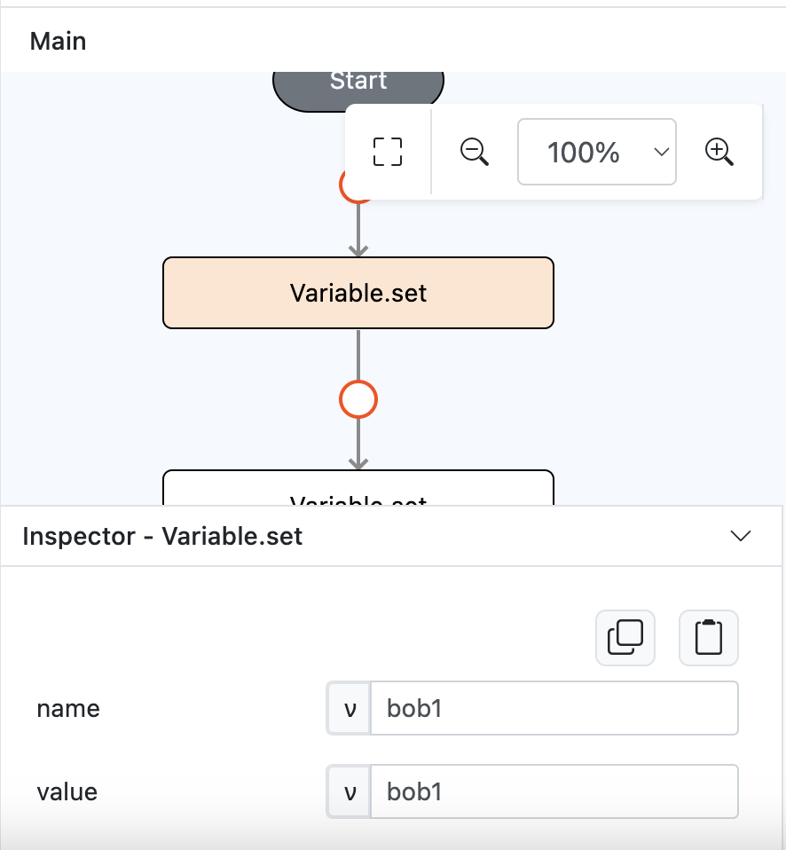
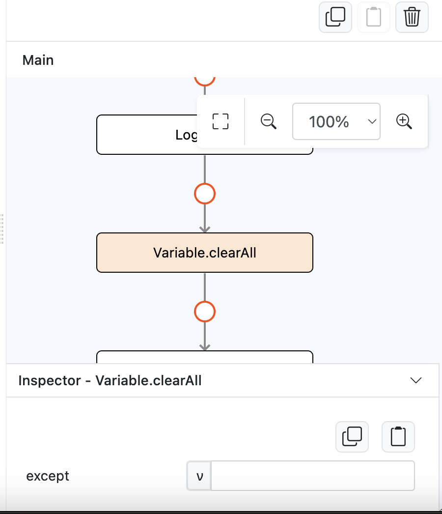
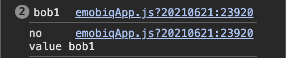

# Variable.clearAll

## Description

Removes the data of all global variables in the app excluding the variables specified.

## Input / Parameter

| Name | Description | Input Type | Default | Options | Required |
| ------ | ------ | ------ | ------ | ------ | ------ |
| exact | The variable(s) that should not be cleared.  | Text/List | - | - | No |

## Output

| Description | Output Type |
| ------ | ------ |
| Returns formatted information.  | String/Text |

## Example

In this example, we will store a value in global variable and then removes it using clearAll function.

### Steps

1. Drag a `button` component into the canvas and open the `Action` tab. Select the `press` event of the button.
2. Create a variable called `bob1` with the value `bob1` by adding `Variable.set` on the event flow.

    

        
    

3. Drag `Log.write` function to the event flow.
4. Call the function `Variable.get` inside the `Log.write` subflow. 
5. Specify the variable name that you would like to access, or use `bob1` to use our stored variable.

    

        
    

6. Call the function `Variable.clearAll`. 

    

        
    

7. Drag another `Log.write` function to the event flow.
8. Call the function `Variable.get` inside the `Log.write` subflow. 
9. Specify the variable name that you would like to access, or use `bob1` to use our stored variable and let the defaultValue value be `no value bob1`.

### Result

1. The console will show us that before using `Variable.clearAll` we still get a value `bob1` but after using `Variable.clearAll` the console will show us the defaultValue `no value bob1` because all the stored variable has been removed.

    

        
    

## Links

### Related Information

See also:

- Functions
    -  [Variable.set](/document/client/2-5-actions-and-visual-logic/action-reference/react-native/Variable/set/set.md)
    -  [Variable.get](/document/client/2-5-actions-and-visual-logic/action-reference/react-native/Variable/get/set.md)