# Global Functions

Global Functions in eMOBIQ allow users to create and manage their own custom functions that can be reused across multiple pages and components. Global functions are user-defined logic blocks built with other logic blocks in eMOBIQ. These functions can be used in the visual logic and provide a convenient and efficient way to add event-driven logic based on specified requirements.

## Creating a Global Function

To create a global function, follow these steps:

1. Access the "Global Functions" section and click on "Add Global Function". A pop-up will appear asking for the name and result global variable name for the function.

2. After the function is created, you can modify the global function name and result global variable name in the inspector if necessary.

Note:
    
In the inspector, 'Parameters' specify the parameters that the function will take as inputs when you call it in the visual logic.

'Result' specifies the global variable name that represents the result of the function. If there is no result global variable name defined, then the return value from a global function will be 'false' by default.

3. The function's implementation is displayed on the visual logic interface, where you can easily edit and customize the function according to your needs.

## Using Arguments in Global Functions
When you define parameters for a global function, these parameters act as the inputs to the function. To use the values passed into these parameters as inputs to other functions within the global function, you must specify that these parameters are of 'param' type.

For example, if a global function has parameters p1 and p2, to use the values passed into p1 and p2 as inputs to other functions within the global function, you have to specify that p1 and p2 are 'param' types. 

In the example below, p1 and p2 are used as inputs of 'param' type to the `add` logic block within the global function:

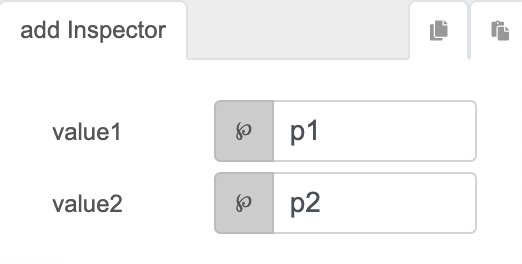

## Using the Return Value of Global Functions

To retrieve the return value of global functions, you can do so by using the `getVar` function on the global variable name associated with the global function result. However, do take note of asynchronous behaviours when using asynchronous functions.

Alternatively, you can also use the global function as a subflow of another function and get the result directly as an input value to the caller function. ([See example below](#example-using-a-global-function))

## Example: Creating a Global Function

In this example, we will create a global function that takes two numbers as inputs and returns their sum.

1. Access the "Global Functions" section and click on "Add Global Function". A pop-up will appear asking for the name and result global variable name for the function. Enter the name as "AddNumbers" and the result global variable name as "AddNumbersResult".

    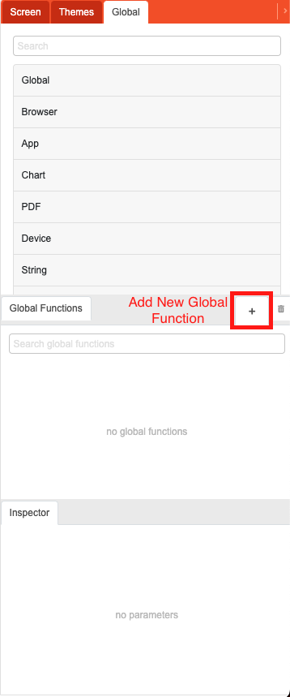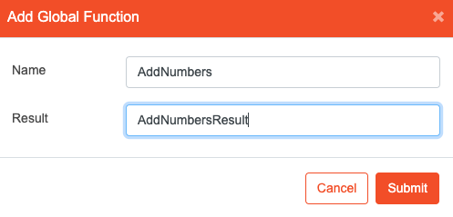

2. After the function is created, you can modify the global function name and result global variable name in the inspector if necessary.

    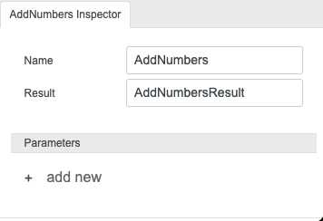

3. In the global function inspector, add two new parameters: `number1` and `number2`.
    
    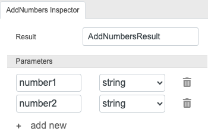

4. In the visual logic interface, add logic blocks to add the two parameters and assign the result to the "AddNumbersResult" global variable.

    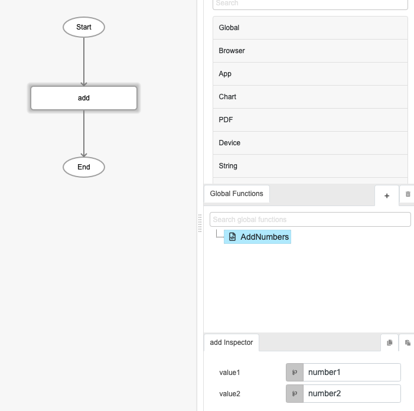

    Note:

    Within the visual logic, to use values passed into the parameters of the global function, you need to use the 'param' parameter type.

5. Finally, assign the result to the result global variable, "AddNumbersResult".

    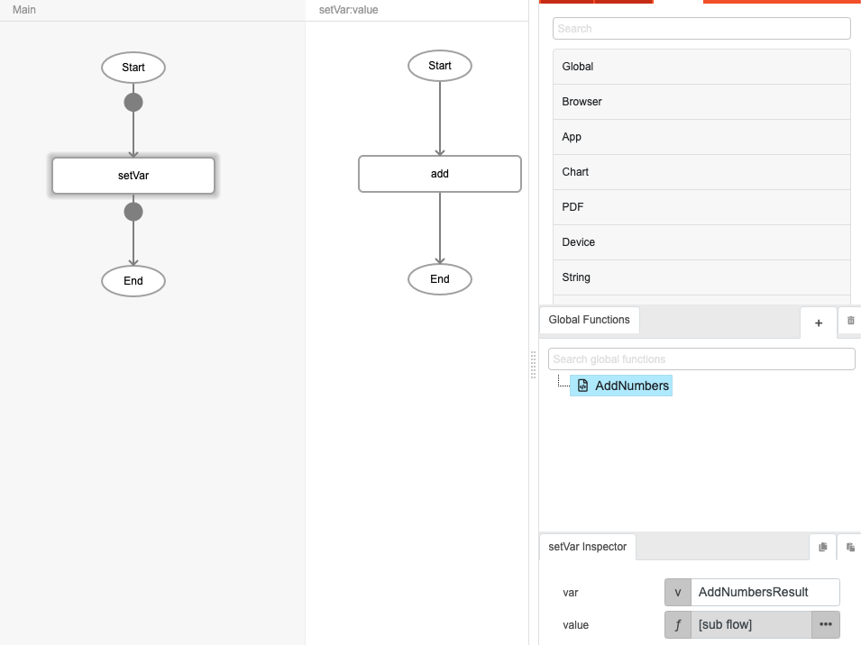

    In this example, we use the `add` function as a subflow to the `setVar`'s value parameter. This means that the return value from the `add` function will be directly given to `setVar` function's value parameter.

Now, the "AddNumbers" global function is created and can be used in the visual logic.

## Example: Using a Global Function

In this example, we will use the "AddNumbers" global function created in the previous example.

1. In the visual logic interface, add the "AddNumbers" logic block.

    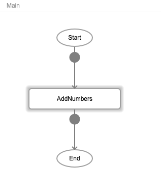

2. Set the 'number1' and 'number2' parameters in the 'call function' logic block.

    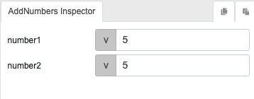

3. Retrieve the result of the "AddNumbers" function either using the `getVar` function to retrieve the "AddNumbersResult" global variable, or using "AddNumbers" as a direct subflow for an input. 

    Using the `getVar` method:

    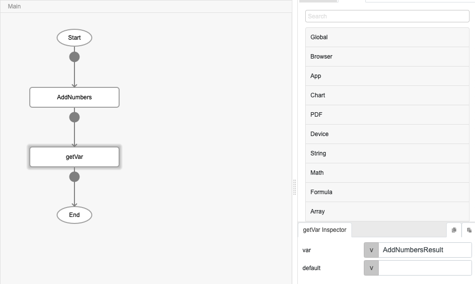

    Using the subflow method (E.g. using the value directly for console):

    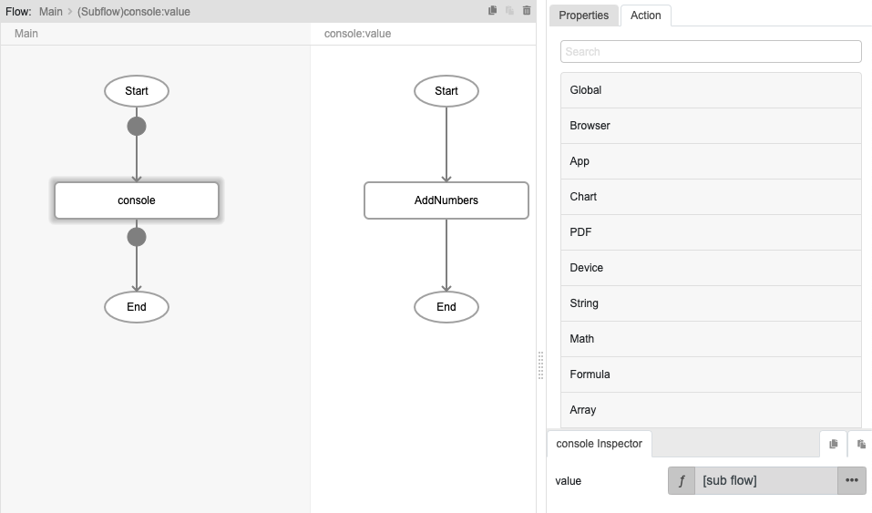

4. The result can now be used in the visual logic.