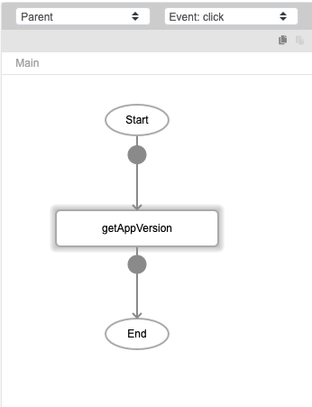
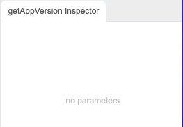

# getAppVersion

## Description

Retrieves the build version of the app.

### Platform Supported

- Mobile
- Web

## Input / Parameters

N/A

## Output

| Description | Output Type |
| ------ | ------ |
| Returns the app version. | Number |

## Callback

N/A

## Video

Coming Soon.

<!-- Format:  -->

## Example

The user wants get version of the App.

### Step

1. Call the function.

    

    

### Result

App version number eg 1.0

### Notes
- the app version will only increased if user click on relase build. 
- user can use functions: console -> getAppVersion to get the version of the app

## Links