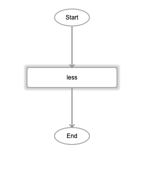

# Less

## Description

The less than comparison operator. It checks whether the first value is less than the second value. The result will return boolean values, true or false.

## Input / Parameter

| Name | Description | Input Type | Default | Options | Required |
| ------ | ------ | ------ | ------ | ------ | ------ |
| value1 | The first value to check. | Number | - | - | Yes |
| value2 | The second value to check against. | Number | - | - | Yes |

## Output

| Description | Output Type |
| ------ | ------ |
| Returns true if the first value is less than the second value, returns false otherwise. | Boolean |

## Callback

N/A

## Video

Coming Soon.

<!-- Format:  -->

## Example

The user wants to check if value 1 is less than value 2.

### Step

1. Call the function.

    

2. value1 :  1 
   value2 : 11 

    

### Result

true

## Links