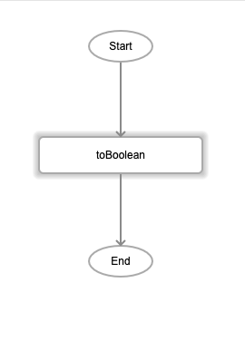
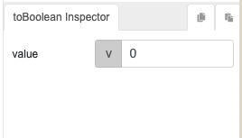
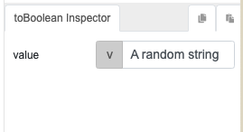

# toBoolean  

## Description

Converts a passed value to a boolean type.

## Input / Parameter

| Name | Description | Input Type | Default | Options | Required |
| ------ | ------ | ------ | ------ | ------ | ------ |
| value | The value to convert to a boolean. | Any | - | - | Yes |

## Output

| Description | Output Type |
| ------ | ------ |
| Returns the passes value as a boolean. | Boolean |

## Callback

N/A

## Video

Coming Soon.

<!-- Format:  -->

## Example

<!-- Share a scenario, like a user requirements. -->

### Steps

1. Drag `toBoolean` function into the event flow. 

    

### Result

| Values | Expected result | 
| ---- | ---- | 
|  | `false` |
|  | `true|

<!-- Explain the output.

Format:  -->

## Links