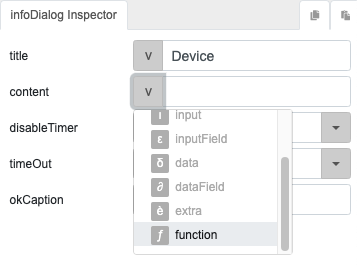
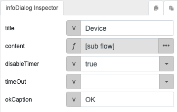

# deviceSerial

## Description

Get the serial number of a device.

## Input / Parameter

N/A

## Output

N/A

## Callback

N/A

## Video

Coming Soon.

## Example

The user wants to display the device serial number in an info dialog.

### Step

| No. | Description |  |
| ------ | ------ | ------ |
| 1. |  | Drag a button to a page in the mobile designer. Select the event `click` for the button and drag the `infoDialog` function to the event flow. Fill in the parameters of the function. For the parameter `content`, select the parameter type `function`. |
| 2. |  | Drag the `deviceSerial` function to the node in the subflow for the `content` parameter. |
    
### Result

When the button is pressed, the infoDialog will appear to show the  serial number of the device.

## Links