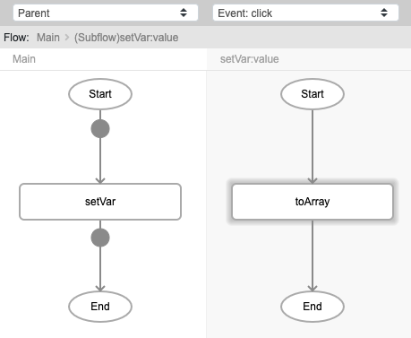
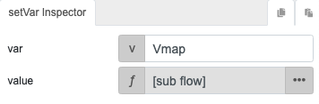
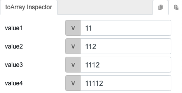
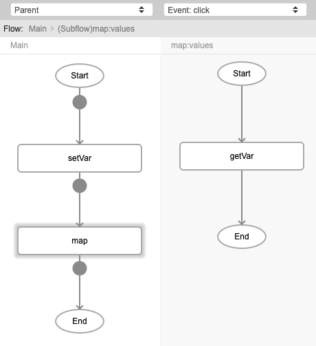
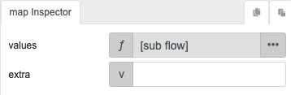
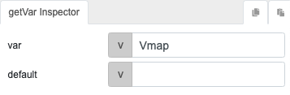
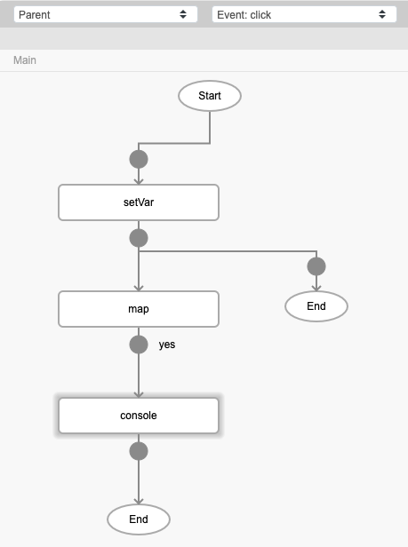
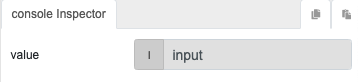
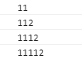

# map

## Description

Loop through all the elements in a list to apply a specific operation to each element. 

Example: loop through a list of numbers to square (operation to be applied) every number.

## Input / Parameter

| Name | Description | Input Type | Default | Options | Required |
| ------ | ------ | ------ | ------ | ------ | ------ |
| values | The list of elements to loop through. | Array/List | - | - | Yes |
| extra | Extra parameters stored and passed to callback. | Any | - | - | No |

## Output

N/A

## Callback

### yesCallback

This will be triggered for every loop that happens within the 'values'.

| Description | Output Type |
| ------ | ------ |
| The current active value within the 'values'. | Any |

## Video

Coming Soon.

<!-- Format:  -->

## Example

The user wants to loop through all the values in an array.

### Step

1. Set a variable "Vmap" using the `setVar` function. Call the function `toArray` in the `value` parameter and set the values for the list.
    
   var: Vmap
   
    

    

    
    
2. Call the function `map`. Call the function `getVar` in the `values` parameter and enter the variable to get.
    
   var : getVar->Vmap  
     
   

   

   
      
4. Add a `console` function to the callback of the `map` function to display the result in the console.
      
   

   

### Result

## Links