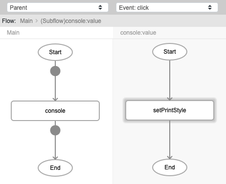
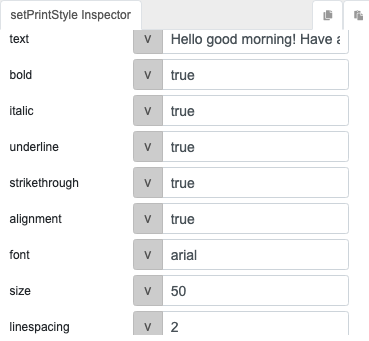
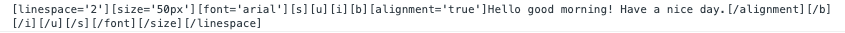

# setPrintStyle

## Description

Generates the format/style for printing.

## Input / Parameter

| Name | Description | Input Type | Default | Options | Required |
| ------ | ------ | ------ | ------ | ------ | ------ |
| text | The text to print. | String/Text | - | - | Yes |
| bold | To bold or not. | Boolean | false | true, false | No |
| italic | To italicize or not. | Boolean | false | true, false | No |
| underline | To underline or not. | Boolean | false | true, false | No |
| strikethrough | To strikethrough or not. | Boolean | false | true, false | No |
| alignment | To align or not. | Boolean | false | true, false | No |
| font | The name of the font. | String/Text | - | - | No |
| size | The size of the text. | Number | - | - | No |
| linespacing | The space between lines. | Number | - | - | No |

## Output

| Description | Output Type |
| ------ | ------ |
| Returns the text to print with the styles specified. | String/Text |

## Callback

N/A

## Video

Coming Soon.

<!-- Format:  -->

## Example

The user wants to format the text to print and view the format generated in the console.

<!-- Share a scenario, like a user requirements. -->

### Steps

1. Call the function `console` in a button component. Call the function `setPrintStyle` inside the `value` parameter of the `console` function.

    

2. Fill in the parameters of the `setPrintStyle` function.

    

<!-- Show the steps and share some screenshots.

1. .....

Format:  -->

### Result

<!-- Explain the output.

Format:  -->

## Links