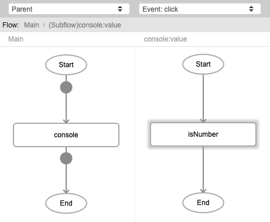
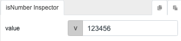

# isNumber
`
## Description

Determines whether the passed value is a number.

## Input / Parameter

| Name | Description | Input Type | Default | Options | Required |`
| ------ | ------ | ------ | ------ | ------ | ------ |
| value | The value to be checked. | Any | - | - | Yes |

## Output

| Description | Output Type |
| ------ | ------ |
| Returns true if value is a number, otherwise returns false. | Boolean |

## Callback

N/A

## Video

Coming soon.

## Example

The user wants to determine whether the value passed is a number.
 

### Step

1. Call the function`console`. Call the function `isNumber` inside the `value` parameter of the `console` function.

    

    
    
### Result

Console will return 'true'.

## Links