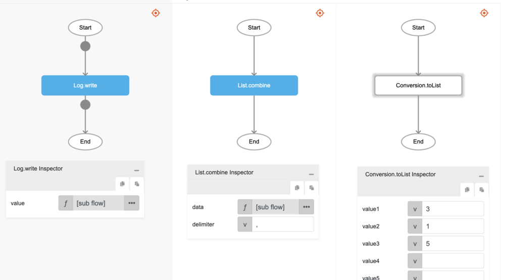
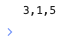

# List.combine

## Description

Combines elements in a list into a string of text using a delimiter.

## Input / Parameter

| Name | Description | Input Type | Default | Options | Required |
| ------ | ------ | ------ | ------ | ------ | ------ |
| data | The list of elements to be converted to a string of text. | List | - | - | Yes |
| delimiter | The separator between each element to form a complete text. | Text | - | - | No |

## Output

| Description | Output Type |
| ------ | ------ |
| Returns the concatenated string of text. | Text |

## Example

In this example, we will turn a list into a comma-separated string and print the result in the console.

### Step

1. Drag a `button` component to the canvas and open the `Action` tab. Select the `press` event of the button and drag the `Log.write` function to the event flow.
2. Call the function `List.combine` inside the `Log.write` function.
3. Then call the function `Conversion.toList` inside the `data` parameter of the `List.combine` function. Add a "," in the `delimiter` parameter.
4. Enter the values of the list to concatenate into a string in the `Conversion.toList` function.

### Result

1. The console will print the concatenated string of text.
2. In this example, the value printed will be `3,1,5`.

