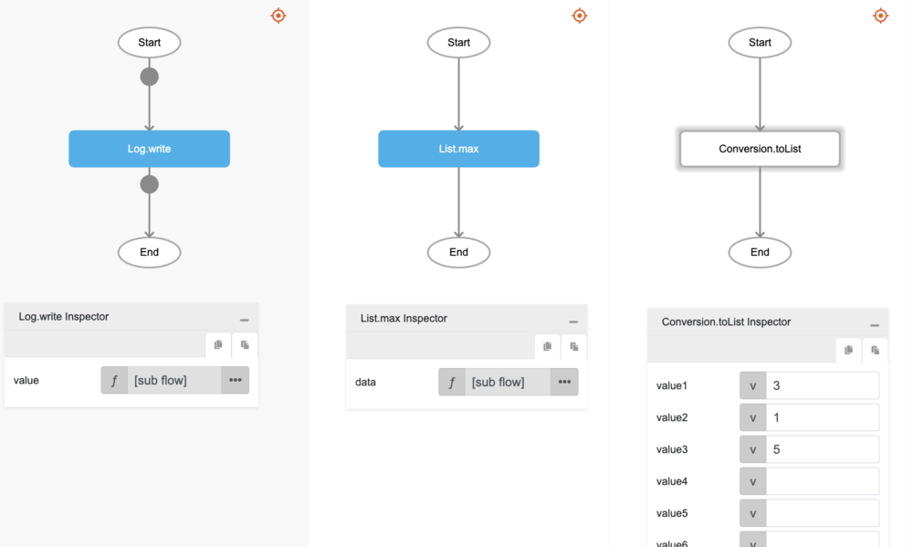
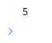

# max

## Description

Returns the largest value of the numbers in the passed array.

## Input / Parameter

| Name | Description | Input Type | Default | Options | Required |
| ------ | ------ | ------ | ------ | ------ | ------ |
| value | The array of values to return the largest value from. | Array/List | - | - | Yes |

## Output

| Description | Output Type |
| ------ | ------ |
| Returns the largest value in the array. | Number |

## Example

In this example, we will get the biggest of the numbers in a list and print the result in the console.

### Step

1. Drag a `button` component to the canvas and open the `Action` tab. Select the `press` event of the button and drag the `Log.write` function to the event flow.
2. Call the function `List.max` inside the `Log.write` function.
3. Then call the function `Conversion.toList` inside the `List.max` function.
4. Enter the values of the list to find the max from.

### Result

1. The console will print the max value of the list.
2. In this example, the value printed will be `5`.

