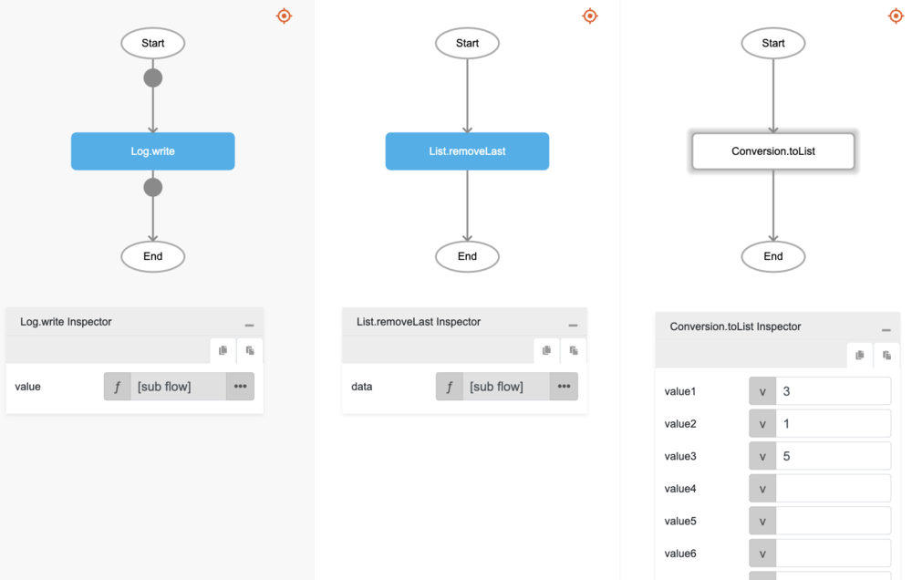

# List.removeLast

## Description

Removes the last element in a list.

## Input / Parameter

| Name | Description | Input Type | Default | Options | Required |
| ------ | ------ | ------ | ------ | ------ | ------ |
| data | The list to be updated. | List | - | - | Yes |

## Output

| Description | Output Type |
| ------ | ------ |
| Returns the updated list. | List |

## Example

In this example, we will remove the last element in a list and print the updated list in the console.

### Steps

1. Call the function `List.removeLast` inside the `Log.write` function.
2. Then call the function `Conversion.toList` inside the `List.removeLast` function.

### Result

1. The console will print `[3, 1]`.

