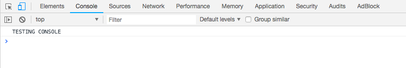

# Log.write

## Description

Using this function will display the output/result in the browser console. 

## Input / Parameter

| Name | Description | Input Type | Default | Options | Required |
| ------ | ------ | ------ | ------ | ------ | ------ |
| value | The output to be shown in the browser console, such as characters, numbers or words. | String/Text | - | - | Yes |

## Output

| Description | Output Type |
| ------ | ------ |
| Returns the value specified in the parameter. | String/Text |

## Example

In this example, we will view the value passed in the `Log.write` function in the console of our broswer for debuging purpose.

### Steps

1. Drag a `button` component into the canvas and open the `Action` tab. Select the `press` event of the button and drag the `Log.write` function to the event flow.
2. Enter the value to be displayed in the console.

    

        
    

### Result

1. The console will print the value passed.

    

        
    

