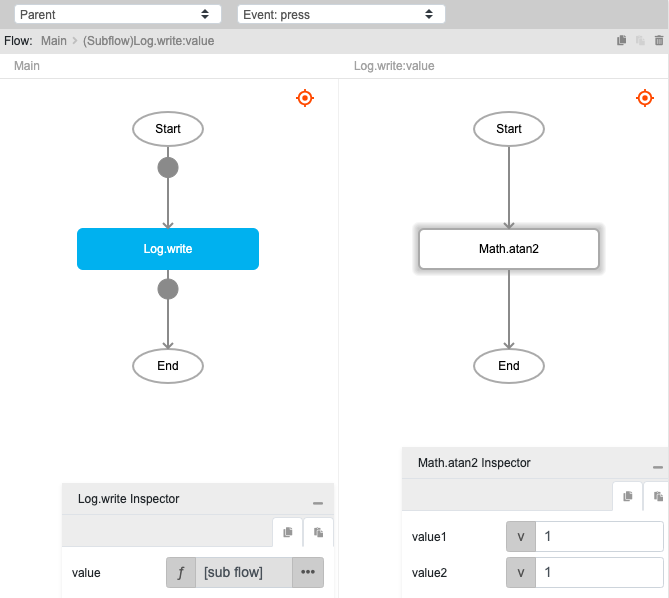
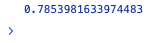

# Math.atan2

## Description

atan2 measures the counterclockwise angle θ, in radians, between the positive x-axis and the point (x, y). 

## Input / Parameter

| Name | Description | Input Type | Default | Options | Required |
| ------ | ------ | ------ | ------ | ------ | ------ |
| x | The x-axis value of the point (x, y). | Number | - | - | Yes |
| y | The y-axis value of the point (x, y). | Number | - | - | Yes |

## Output

| Description | Output Type |
| ------ | ------ |
| Returns the angle in radians. | Number |

## Example

In this example, we will get the angle using `Math.atan2` function and print it in the console.

### Steps

1. Drag a `button` component into the canvas and open the `Action` tab. Select the `press` event of the button and drag the `Log.write` function to the event flow.
2. Call the function `Math.atan2` inside the `Log.write` function.
3. Enter the value to get the angle of.

    

        
    

### Result

1. The console will print the value of the angle in radians.

    

        
    

