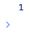

# Math.modulo

## Description

Get the remainder of two numbers after dividing them.

## Input / Parameter

| Name | Description | Input Type | Default | Options | Required |
| ------ | ------ | ------ | ------ | ------ | ------ |
| dividend | The number to be divided. | Number | - | - | Yes |
| divisor | The number to divide the first value by. | Number | - | - | Yes |

## Output

| Description | Output Type |
| ------ | ------ |
| Returns the remainder of the two values. | Number |

## Example

In this example, we will get the remainder after dividing two values and print it in the console.

### Steps

1. Drag a `button` component into the canvas and open the `Action` tab. Select the `press` event of the button and drag the `Log.write` function to the event flow.
2. Call the function `Math.modulo` inside the `Log.write` function.
3. Enter the values for the dividend and the divisor.

### Result

1. The console will print `1`.

