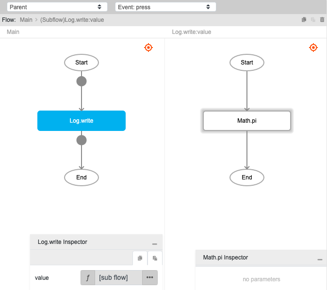
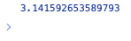

# Math.pi

## Description

Get the value of pi, which is the ratio of the circumference of a circle to its diameter. The output will return approximately 3.14159.

## Input / Parameter

N/A

## Output

| Description | Output Type |
| ------ | ------ |
| Returns the value of pi. | Number |

## Example

In this example, we will call the `pi` function and print the value in the console.

### Steps

1. Drag a `button` component into the canvas and open the `Action` tab. Select the `press` event of the button and drag the `Log.write` function to the event flow.
2. Call the function `Math.pi` inside the `Log.write` function.

    

        
    

### Result

1. The console will print the value of pi.

    

        
    

