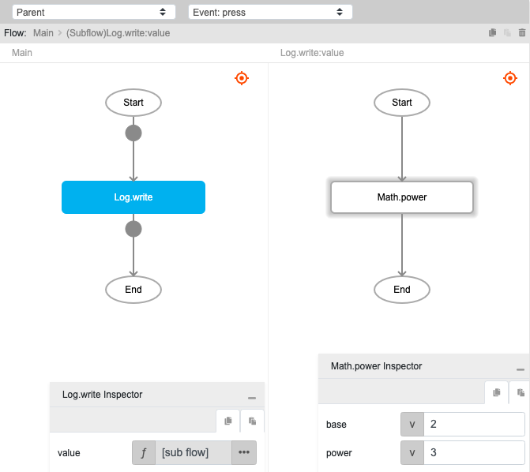
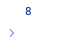

# Math.power

## Description

Exponentiation of two numbers. The output will return the base number raised to the power (or exponent) passed.

## Input / Parameter

| Name | Description | Input Type | Default | Options | Required |
| ------ | ------ | ------ | ------ | ------ | ------ |
| base | The base number to be raised. | Number | - | - | Yes |
| exponent | The number of powers to raise the base number to. | Number | - | - | Yes |

## Output

| Description | Output Type |
| ------ | ------ |
| Returns the base number raised to the power specified. | Number |

## Example

In this example, we will find the value of a base number raised to power specified and print it in the console.

### Steps

1. Drag a `button` component into the canvas and open the `Action` tab. Select the `press` event of the button and drag the `Log.write` function to the event flow.
2. Call the function `Math.power` inside the `Log.write` function.
3. Enter the values for the base and the power.

### Result

1. The console will print `8`.

