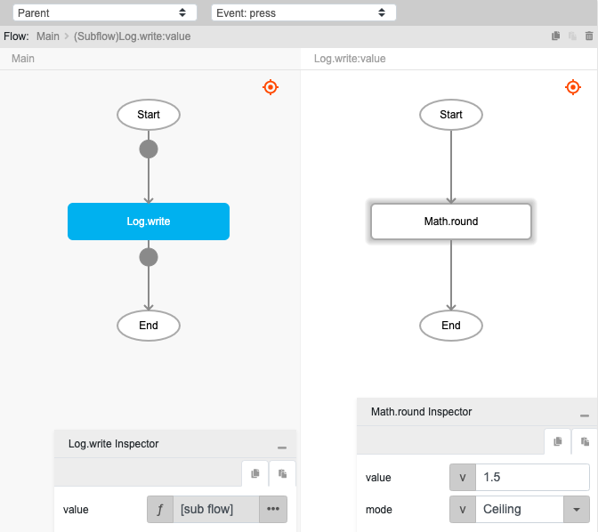
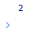

# Math.round

## Description

Rounds up a number to the nearest whole number and returns the smallest integer greater than or equal to the passed number.

## Input / Parameter

| Name | Description | Input Type | Default | Options | Required |
| ------ | ------ | ------ | ------ | ------ | ------ |
| value | The number to round. | Number | - | - | Yes |
| mode | The mode of rounding. | String | HALF_UP | CEILING, DOWN, FLOOR, HALF_DOWN, HALF_EVEN, HALF_UP, UP | Yes |

### `mode` parameter options:

**CEILING**: Rounds towards positive infinity. For positive numbers, it behaves like rounding up, meaning it moves to the nearest higher integer if there's a fractional part. For negative numbers, it effectively rounds towards zero by moving up to the next higher integer (or less negative number).

**DOWN**: Rounds towards zero. It drops the fractional part of the number, regardless of whether the number is positive or negative. This is also known as truncation.

**FLOOR**: Rounds towards negative infinity. For positive numbers, it moves down to the nearest lower integer. For negative numbers, it moves away from zero to the next more negative integer.

**HALF_DOWN**: Rounds towards the nearest neighbor, but if the number is exactly halfway between two integers, it rounds down towards the lower integer. This applies to both positive and negative numbers.

**HALF_EVEN**: Rounds towards the nearest neighbor, but if the number is exactly halfway between two integers, it rounds towards the nearest even integer.

**HALF_UP**: Rounds towards the nearest neighbor, but if the number is exactly halfway between two integers, it rounds up towards the higher integer.

**UP**: Rounds away from zero. It increases the magnitude of the number to the next higher integer, regardless of whether the number is positive or negative.

## Output

| Description | Output Type |
| ------ | ------ |
| Returns the rounded number. | Number |

## Example

In this example, we will round the value `1.5` and print the result in the console.

### Steps

1. Drag a `button` component into the canvas and open the `Action` tab. Select the `press` event of the button and drag the `Log.write` function to the event flow.
2. Call the function `Math.round` inside the `Log.write` function.
3. Enter the values for the value to be rounded and the mode to be used.

### Result

1. The console will print `2`.

