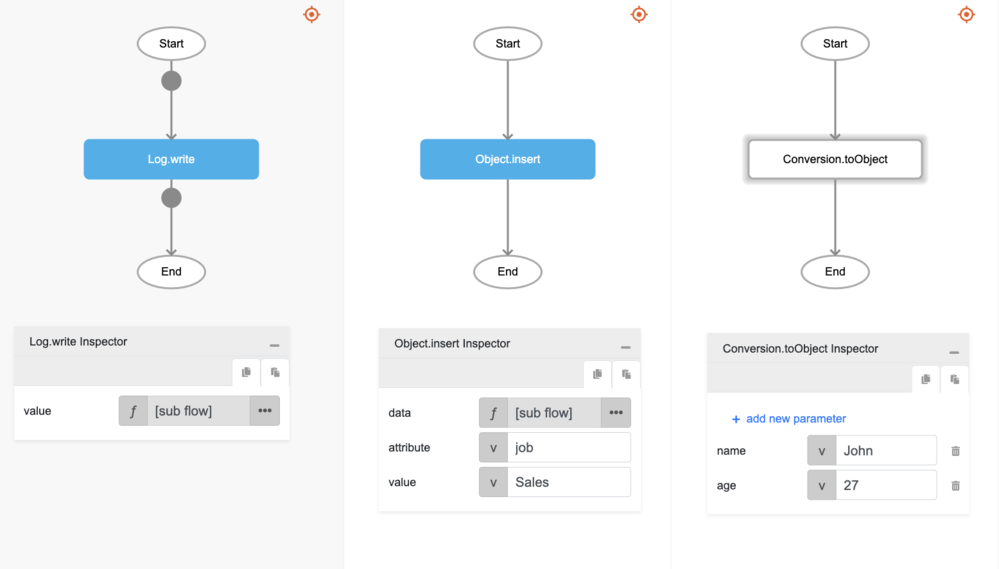

# Object.insert

## Description

Adds a key and a value to an object.

## Input / Parameter

| Name | Description | Input Type | Default | Options | Required |
| ------ | ------ | ------ | ------ | ------ | ------ |
| data | The reference object to be updated. | Object | - | - | Yes |
| attribute | The key to be added to the object. | Text | - | - | Yes |
| value | The value of the key. It can be null. | Any | - | - | No |

## Output

| Description | Output Type |
| ------ | ------ |
| Returns the updated object. | Object |

## Example

In this example, we will insert a new key and value to an object and print the updated object in the console.

### Steps

1. Drag a `button` component into the canvas and open the `Action` tab. Select the `press` event of the button and drag the `Log.write` function to the event flow.
2. Call the function `Object.insert` inside the `Log.write` function.
3. Then call the function `Conversion.toObject` inside the `data` parameter of the `Object.insert` function.
4. Sample parameters are shown in the picture below.

### Result

1. The console will print the updated object.
2. For this example, the value printed will be `{age: '27', name: 'John', job: 'Sales'}`.

