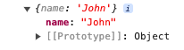

# Object.remove

## Description

Removes a value from an object using a key.

## Input / Parameter

| Name | Description | Input Type | Default | Options | Required |
| ------ | ------ | ------ | ------ | ------ | ------ |
| data | The reference object to be updated. | Object | - | - | Yes |
| attribute | The key of the value to be removed from the object. | Text | - | - | Yes |

## Output

| Description | Output Type |
| ------ | ------ |
| Returns the updated object. | Object |

## Example

In this example, we will remove a key from an object and print the updated object in the console.

### Step

1. Drag a `button` component into the canvas and open the `Action` tab. Select the `press` event of the button and drag the `Log.write` function to the event flow.
2. Call the function `Object.remove` inside the `Log.write` function.
3. Then call the function `Conversion.toObject` inside the `data` parameter of the `Object.remove` function.
4. Sample parameters are shown in the picture below.

### Result

1. The console will print the updated object.
2. For this example, the printed value will be `{name: 'John'}`.

