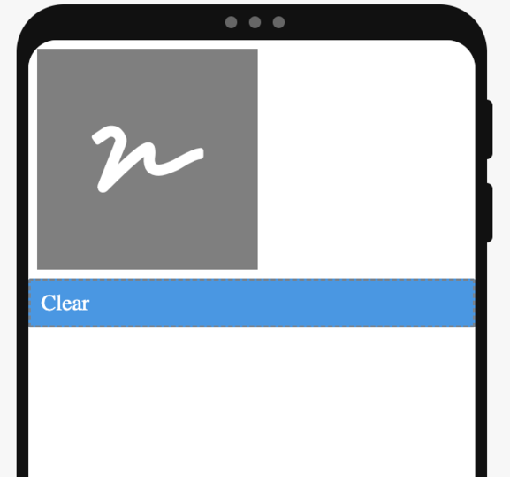
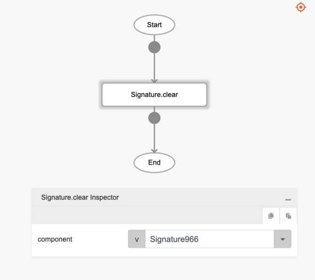
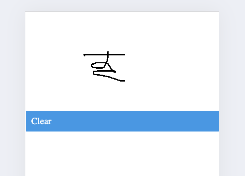

# Signature.clear

## Description

A function to clear the canvas and allow users to redraw the signature.

## Input / Parameter

| Name | Description | Input Type | Default | Options | Required |
| ------ | ------ | ------ | ------ | ------ | ------ |
| component | The name of the signature component. | Text | - | - | Yes |

## Output

Note: The signature component will be updated and clear the canvas.

## Example

In this example, we will clear the current signature canvas.

### Steps

1. Drag a `signature` and `button` component into the canvas and open the `Action` tab. Label the button "Clear".

    

        
    

2. Select the `press` event of the button component and drag the `Signature.clear` function to the event flow. Select the signature component that should be cleared when this button is clicked.

    

        
    

3. Save and preview the app. Sign on the signature component canvas, then click the 'Clear' button to clear the canvas.

    

        
    

### Result

1. The canvas of the signature component specified in the `component` parameter will be cleared.

    

        
    

## Links

### Related Information

See also:

- Components
    - [Signature]()