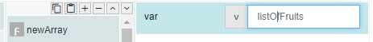
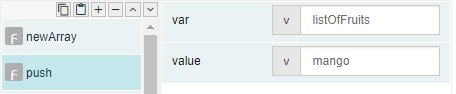
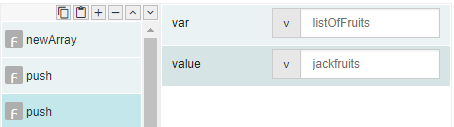
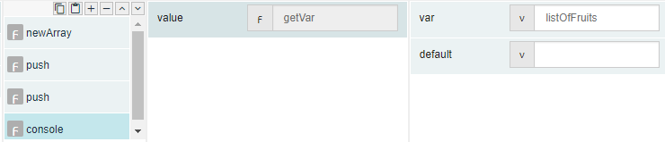
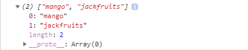

# push

## Description

Adds a new value to an array. An array has to be created using the newArray function first, before using the push function to add values to the array.

## Input / Parameter

| Name | Description | Input Type | Default | Options | Required |
| ------ | ------ | ------ | ------ | ------ | ------ |
| var | The name of the array to add a new value to. | String/Text | - | - | Yes |
| value | The value to be added to the array. | String/Text | - | - | Yes |

## Output

| Description | Output Type |
| ------ | ------ |
| The updated array of values. | Array/List |

## Callback

N/A

## Video

Coming Soon.

<!-- Format:  -->

## Example

The user wants to add new value into the array.

### Step

1. Call the function "newArray" and set the        variable name.
    
   var: listOfFruits 

    
    
2. Call the function "push" and define the         value. 
   value: mango
    
   

3. Call the function "push" and define the         value. 
   value: jackfruits
    
    
   
4. Add a console and call the function             "getVar" to view the values in "listOfFruits" array. 
   value = getVar = listOfFruits
   
    
    
    
### Result

"mango" and "jackfruits" are added to the array successfully.

## Links