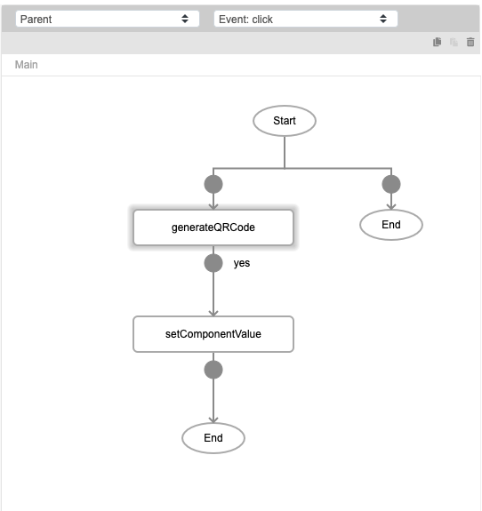
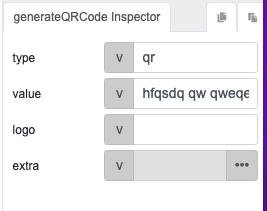
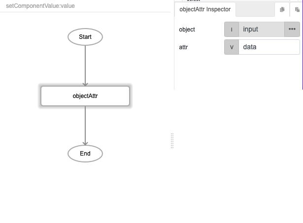
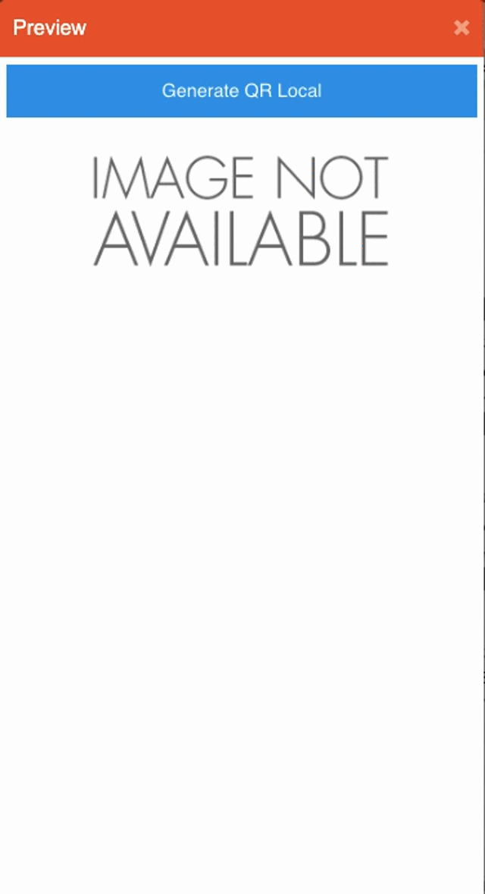

# generateQRCode

## Description

Creates an image for a type of matrix barcode (QR Code).

## Input / Parameter

| Name | Description | Input Type | Default | Options | Required |
| ------ | ------ | ------ | ------ | ------ | ------ |
| type | Not currently in use by the function. | String/Text | - | - | No |
| value | The value to be attached to the QR code. | String/Text | - | - | Yes |
| logo | An image base64 or URL of an image to be appended to the QR Code. | String/Text | - | - | No |
| extra | The value to be included to the 'callback' as a system value under 'extra'. | Any | - | - | No |

## Output

N/A

## Callback

### callback

It is executed after the function completeled generating the matrix barcode (QR Code).

| Description | Output Type |
| ------ | ------ |
| Returns the image base64 value. | String/Text |

## Video

Coming Soon.

<!-- Format:  -->

## Example

### Steps

1. First we add 2 components to the page: 
   1. A button to generate the QR code
   2. `imgQR`, an image placeholder for the QR code once generated.

    

2. Select the "Generate QR Local" button and add these 2 functions to the event flow:

    

3. For `generateQRCode` function, the parameters are: 

    

4. For the `setComponentFunction`, we set the "component" value to "imgQR", the image placeholder created in step 1. 

    

    For 'value', we add a subflow with the function "objectAttr" like so: 

    

### Result

## Links