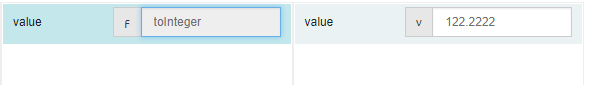

# toInteger  

## Description

Converts a passed value to an integer type.

## Input / Parameter

| Name | Description | Input Type | Default | Options | Required |
| ------ | ------ | ------ | ------ | ------ | ------ |
| value | The value to convert to an integer. | Any | - | - | Yes |

## Output

| Description | Output Type |
| ------ | ------ |
| Returns the passed value as an integer. | Number |

## Callback

N/A

## Video

Coming Soon.

<!-- Format:  -->

## Example

The user wants to convert a value to integer.

### Step

1. Call the function.
    
   value : 122.2222

   
 
### Result

122

## Links