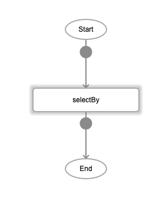
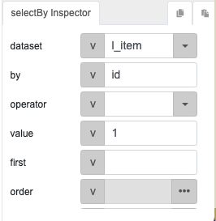
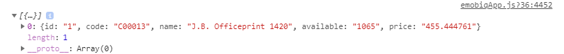

# selectBy

## Description

Retrieves the specified field from a local table.

## Input / Parameter

| Name | Description | Input Type | Default | Options | Required |
| ------ | ------ | ------ | ------ | ------ | ------ |
| dataset | The name of the local table to select the records from. | String/Text | - | - | Yes |
| by | The name of the field to select the records from. | String/Text | - | - | Yes |
| operator | The operator to use to determine the records to select. | String/Text | = | =, >, <, >=, <=, !=, like, ilike | No |
| value | The records to be selected from the local table. | String/Text | - | - | Yes |
| first? | ? | String/Text | - | - | No |
| extra | Extra parameters stored and passed to callback. | Any | - | - | No |

## Output

| Description | Output Type |
| ------ | ------ |
| Returns the list of records selected from the local table. | Array/List |

## Callback?

### callback

The function to be executed if the specified records are selected successfully.

### errCallback

The function to be executed if the specified records are not selected successfully.

## Video

Coming Soon.

<!-- Format:  -->

## Example

The user wants to display the data which id=1 in dataset "l_item".

### Step

1. Call the function "selectBy"
   
    

2. Specify the parameters: 

    | | | 
    | ---- | ---- | 
    | dataset | l_item | 
    | by | id |
    | value | 1 |

    
    
### Result

 

## Links