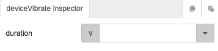

# deviceVibrate

## Description

Activate vibration of mobile device.

## Input / Parameter

| Name | Description | Data Type | Default | Options | Required |
| ------ | ------ | ------ | ------ | ------ | ------ |
| duration | The duration of vibration in milliseconds. | Number | - | - | Yes |

## Output

N/A

## Callback

N/A

## Video

Coming Soon.

## Example

The user wants to trigger the mobile vibration function.

### Step

| No. | Description |  |
| ------ | ------ | ------ |
| 1. |  | Drag a button to a page in the mobile designer. Select the event `click` for the button and drag the `deviceVibrate` function to the event flow. Fill in the parameters of the function. |

### Result

When the button is pressed, the mobile device will vibrate for 2s.

## Links