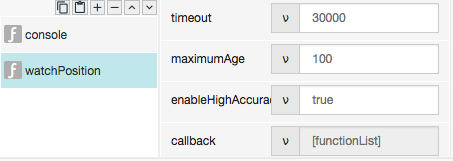
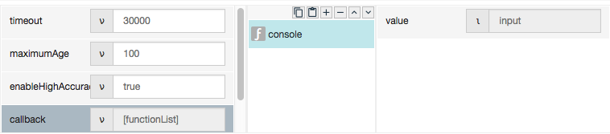
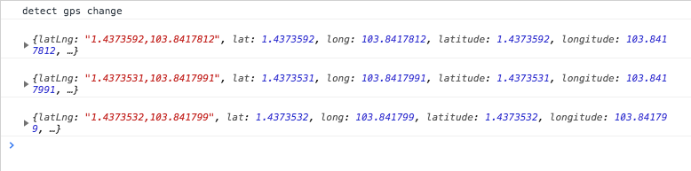

# watchPosition

## Description

Return the location details (GPS coordinate) of the device if detect changes.

## Input / Parameters

| No | Name | Description | Data Type | Required | Example |
| ------ | ------ | ------ |------ | ------ | ------ |
| 1 | timeout | Connection time out period in millisecond | Integer | Yes | 1000, 2000, ...
| 2 | maximumAge | maximumAge period in millisecond | Integer | No | 100
| 3 | enableHighAccuracy | Enable High Accuracy | Boolean | No |
| 4 | enableHighAccuracy | Enable High Accuracy | Boolean | No |

## Output

## Callback

## Video

## Example

Users want to get the current location of mobile device if the location are changed.

### Step

1. Call the function.  
    timeout: 30000 (connection timeout after 30 seconds) 
    maximumAge: 100
    enableHighAccuracy: true

    
    
2. In callback, add a console -> input function to view the result.

    
    
### Result

User will see the result below in console (the latlng will have different value): 

### Video

- N/A
<!---->

## Links

- N/A