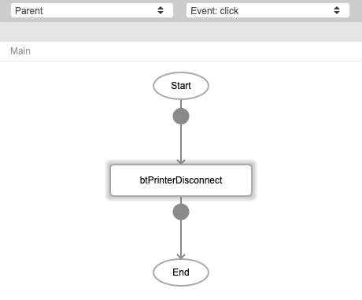
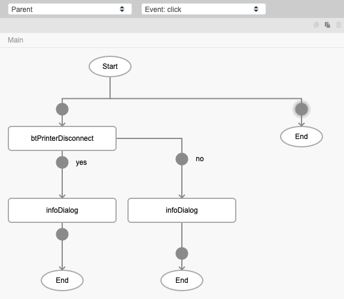
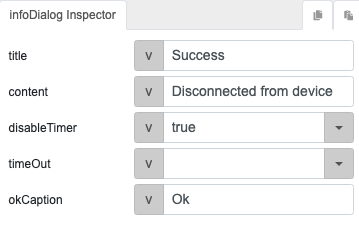
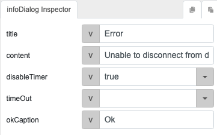

# btPrinterDisconnect

## Description

Disconnects a bluetooth printer from the device.

## Input / Parameter

| Name | Description | Input Type | Default | Options | Required |
| ------ | ------ | ------ | ------ | ------ | ------ |
| timeout | The duration the printer can be idle for before it is disconnected. | String/Text | - | - | Yes |

## Output

N/A

## Callback

### callback

The function to be executed if the printer is disconnected successfully.

### errCallback

The function to be executed if the printer is not disconnected successfully.

## Video

Coming Soon.

<!-- Format:  -->

## Example

The user wants to disconnect a printer from their device.

<!-- Share a scenario, like a user requirements. -->

### Steps

1. Call the function `btPrinterDisconnect` in a button component. 

    

2. Call the function `infoDialog` in the callbacks of the `btPrinterDisconnect` function.

    

    

    

<!-- Show the steps and share some screenshots.

1. .....

Format:  -->

### Result

If the printer is idle longer than the timeout duration passed, the printer will be disconnected and the success infoDialog will appear. If the printer is not disconnected successfully, the error infoDialog will appear.

1. Select the printer to disconnect from the combobox. 
    
    

2. Press the Disconnect button. If the printer is disconnected successfully, the success infoDialog will appear. If the printer is not disconnected successfully, the error dialog will appear.

<!-- Explain the output.

Format:  -->

## Links