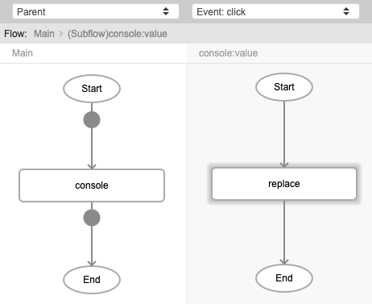
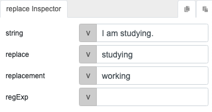
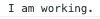

# Replace

## Description

Locate a particular set of characters or a pattern within a text and substitute it with something else.

## Input / Parameter

| Name | Description | Input Type | Default | Options | Required |
| ------ | ------ | ------ | ------ | ------ | ------ |
| string | The value to be updated. | String/Text | - | - | Yes |
| replace | The value to be replaced. It can be just a text or a regular expression (if 'regExp' is set to true). | String/Text | - | - | Yes |
| replacement | The value to use as a replacement. | String/Text | - | - | No |
| regExp | To use regular expression for the 'replace' value. | Boolean | false | - | No |

Note: See [Regular Expression Guide] to understand regular expression more.

## Output

| Description | Output Type |
| ------ | ------ |
| Returns the updated value. | String/Text |

## Callback

N/A

## Video

Coming soon.

## Example

The user wants to replace some words in a string. 

### Step

1. Call the function `console`. Call the function `replace` inside the `value` parameter of the `console` function. 
   string: I am studying. 
   replace: studying 
   replacement: working 
    
   

   

### Result

## Links