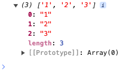

# List.fill

## Description

Fills a string of text into a list using a separator.

## Input / Parameter

| Name | Description | Input Type | Default | Options | Required |
| ------ | ------ | ------ | ------ | ------ | ------ |
| value | The string of text to be converted to a list. | Text | - | - | Yes |
| separator | The separator between texts to create the required format for the list. | Text | - | - | Yes |

## Output

| Description | Output Type |
| ------ | ------ |
| Returns the list of separated strings of text. | List |

## Example

In this example, we will turn a comma-separated string into a list and print the result in the console.

### Step

1. Drag a button component to the canvas and open the `Action` tab. Select the `press` event of the button and drag the `Log.write` function to the event flow.
2. Call the function `List.fill` inside the `Log.write` function.
3. Enter the parameters for the `List.fil` function. In this example, we will enter "1,2,3" for the `value` parameter and "," for the `separator` parameter.

    

        
    

### Result

1. The console will print the list of separated strings of text.
2. In this example, the printed value will be `['1', '2', '3']`.

    

        
    

## Links

### Related Information

See also:

- Functions
    - [Conversion.toList](/document/client/2-5-actions-and-visual-logic/action-reference/react-native/Conversion/toList/toList.md)