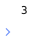

# List.find

## Description

Returns the position of an element in a list or the element at a specified position.

## Input / Parameter

| Name | Description | Input Type | Default | Options | Required |
| ------ | ------ | ------ | ------ | ------ | ------ |
| data | The list to be searched. | List | - | - | Yes |
| value | The element to look for. | Any | - | - | Partial (Yes if no 'position'.) |
| position | The position to search for. | Number | - | - | Partial (Yes if no 'value'.) |

## Output

| Description | Output Type |
| ------ | ------ |
| Returns the position of the element in the list or the element itself. | Number | Text |

## Example

In this example, we will find the value of an element in a list based on the index and print the result in the console.

### Step

1. Drag a `button` component to the canvas and open the `Action` tab. Select the `press` event of the button and drag the `Log.write` function to the event flow.
2. Call the function `List.find` inside the `Log.write` function.
3. Then call the function `Conversion.toList` inside the `data` parameter of the `List.find` function. 
4. Enter the `value` parameter to return the position of the value in the list or enter the `position` parameter to return the value that is in that position in the list. In this example, we will enter the `position` parameter.

    

        
    

### Result

1. The console will print the position of the element specified or the element at the position specified.
2. In this example, the value that will be printed is `3`, as it is the element at position '2' in the list that was passed. (Note: position in a list starts from value '0')

    

        
    

## Links

### Related Information

 See also:

 - Functions
    - [Conversion.toList](/document/client/2-5-actions-and-visual-logic/action-reference/react-native/Conversion/toList/toList.md)
