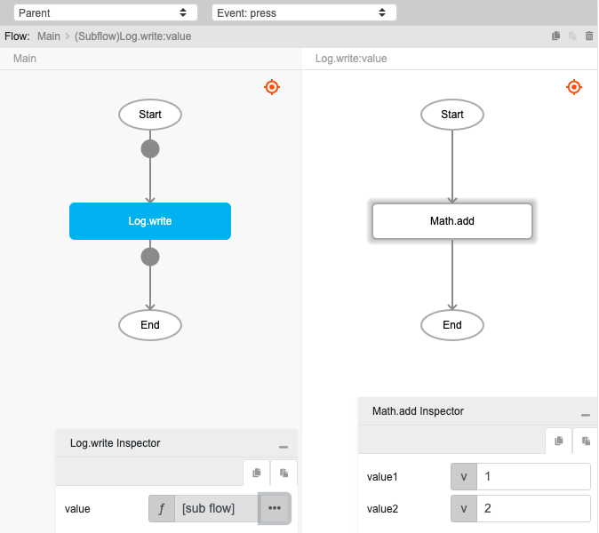
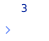

# Math.add

## Description

Addition of two numbers. The output will return the sum of the two numbers.

## Input / Parameter

| Name | Description | Input Type | Default | Options | Required |
| ------ | ------ | ------ | ------ | ------ | ------ |
| value1 | The first number to add. | Number | - | - | Yes |
| value2 | The second number to add. | Number | - | - | Yes |

## Output

| Description | Output Type |
| ------ | ------ |
| Returns the sum of the two values. | Number |

## Example

In this example, we will get the sum of two values and print it in the console.

### Steps

1. Drag a `button` component into the canvas and open the `Action` tab. Select the `press` event of the button and drag the `Log.write` function to the event flow.
2. Call the function `Math.add` inside the `Log.write` function.
3. Enter the values to be added.

    

        
    

### Results

1. The console will print `3`.

    

        
    

