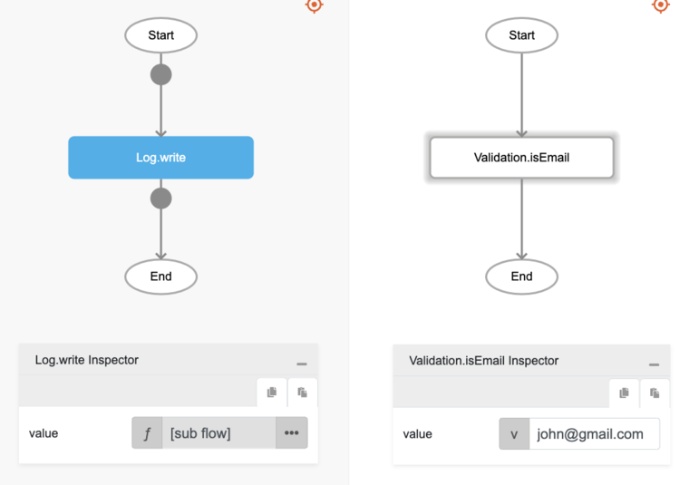

# Validation.isEmail

## Description

Checks whether the value input is a valid email.

## Input / Parameter

| Name | Description | Input Type | Default | Options | Required |
| ------ | ------ | ------ | ------ | ------ | ------ |
| value | The value to be checked. | Any | - | - | Yes |

## Output

N/A

## Example

In this example, we will check whether an email is valid and print the result in the console.

### Steps

1. Drag a `button` component into the canvas and open the `Action` tab. Select the `press` event of the button and drag the `Log.write` function to the event flow.
2. Call the function `Validation.isEmail` inside the `Log.write` function.
3. Enter the value for the email to be validated. In this example, we will enter the value "john@gmail.com".

    

        
    

### Result

1. The console will print `true` since it is a valid email by format.