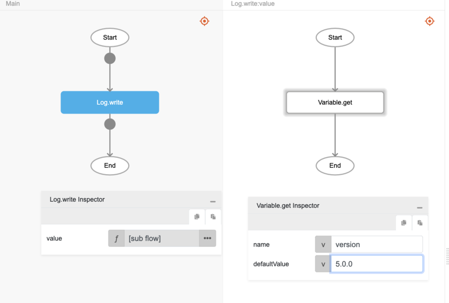

# Variable.get

## Description

Returns the value of a global variable.

## Input / Parameter

| Name | Description | Input Type | Default | Options | Required |
| ------ | ------ | ------ | ------ | ------ | ------ |
| name | The name of the variable. | String/Text | - | - | Yes |
| defaultValue | The default value of the variable. | String/Text | - | - | No |

## Output

| Description | Output Type |
| ------ | ------ |
| Returns the value of the global variable if there is a value, returns the `defaultValue` value otherwise. | String/Text |

## Example

In this example, we will get the value of a global variable and print it in the console.

### Steps

1. Drag a `button` component into the canvas and open the `Action` tab. Select the `press` event of the button and drag the `Log.write` function to the event flow.
2. Call the function `Variable.get` inside the `Log.write` function. (*Note: The `Log.write` function is used here for ease of demostrating the output.)
3. Specify the variable name that you would like to access.

    

        
    

### Result

1. If the specified global variable has previously been set (see [`set`](./set)), the function will return the variable's value ("1.0.0" in this example).

    

        
    

2. If the specified global variable does not exist, the function will return the value in `defaultValue`.

    

        
    

## Links

### Related Information

See also:

- Functions
    -  [Variable.set](/document/client/2-5-actions-and-visual-logic/action-reference/react-native/Variable/set/set.md)