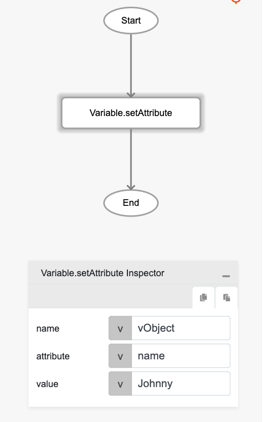

# Variable.setAttribute

## Description

Stores value into an attribute of an object variable in the application's local variable pool.

## Input / Parameter

| Name | Description | Input Type | Default | Options | Required |
| ------ | ------ | ------ | ------ | ------ | ------ |
| name | The variable's identifier containing the object. | Text | - | - | Yes |
| attribute | The attribute name of the object variable to set value to. | Text | - | - | Yes |
| value | The value to be set for this variable. Can be null. | Any | - | - | No |

## Output

| Description | Output Type |
| ------ | ------ |
| Returns the formatted information. | Object |

### Object

| Key | Description | Output Type |
| ------ | ------ | ------ |
| success | Boolean value to denote whether the function was executed successfully. | Text |
| message | The message to print. | Text |
| data | Any additional message or data to print. | Text |

## Example

In this example, we will set the value of an object variable's attribute and check whether the variable attribute has been set successfully in the console.

### Steps

1. Drag the function `Variable.setAttribute` into the event flow window. 
2. Create a variable called `vObject` with the attribute `name` that has value `Johnny`.

    

        
    

3. This will create a global variable called `vObject` (if it doesn't exist already) with attribute `name` containing the value `Johnny` that can be accessed by other components or on other pages of your app.

### Result

1. The value of the attribute `name` of the global variable `vObject` can be accessed by using the `Variable.getAttribute`. 
2. Using the above flow will display the value `Johnny` in the browser console.

## Links

### Related Information

See also 

- Functions
    - [Variable.getAttribute](/document/client/2-5-actions-and-visual-logic/action-reference/react-native/Variable/getAttribute/getAttribute.md)