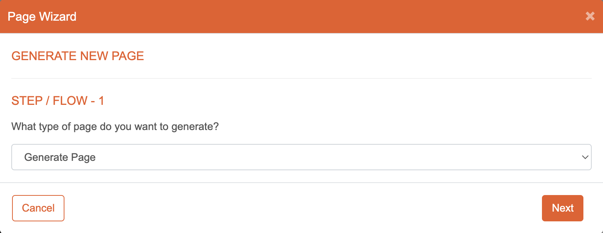
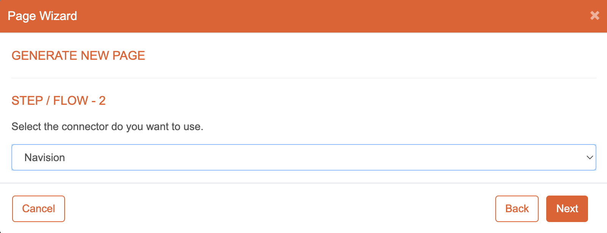
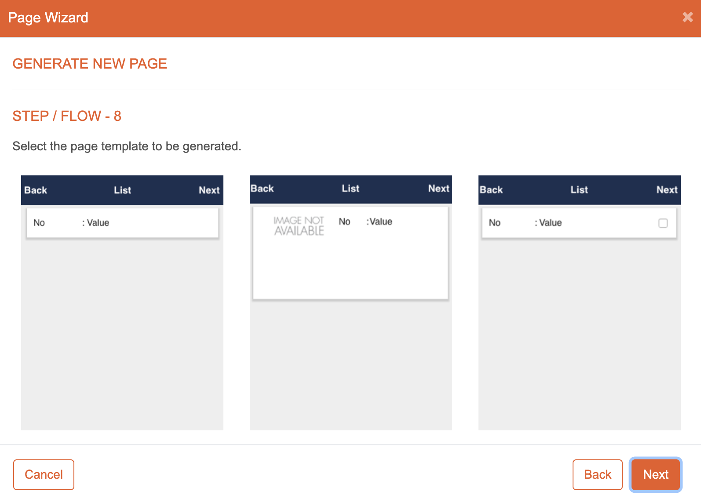

# Page Wizard

## Introduction

The Page Wizard in eMOBIQ is a powerful tool that simplifies the process of creating pages for your mobile app. It guides you through a step-by-step flow based on your selections, allowing you to generate pages with customized functionality. This documentation will walk you through each step of the Page Wizard, providing detailed instructions.

## Flow

1. **Choose the Type of Page:**

   

   The first step of the Page Wizard is to select the type of page you want to create. Choose from various options such as form page, list page, detail page, or custom page type. Select the appropriate page type based on your requirements.

2. **Configure Datasources and Map Fields (if applicable):**

   

   In this step, you have the option to configure datasources and map fields to page components. If your selected page type requires data from external sources, configure the datasources to retrieve the necessary data. You can also map the fields from the datasources to the respective components on the page, populating it with dynamic data.

3. **Choose a Page Template:**

   

   Finally, choose a page template that suits your selected page type. eMOBIQ provides a range of pre-designed templates tailored for different page types. Browse through the available templates and select the one that aligns with your desired visual layout and functionality.

## Conclusion

The Page Wizard in eMOBIQ simplifies the process of creating pages for your mobile app. By following the flow outlined in this documentation, you can generate pages with ease, customized to your specific needs and requirements.
