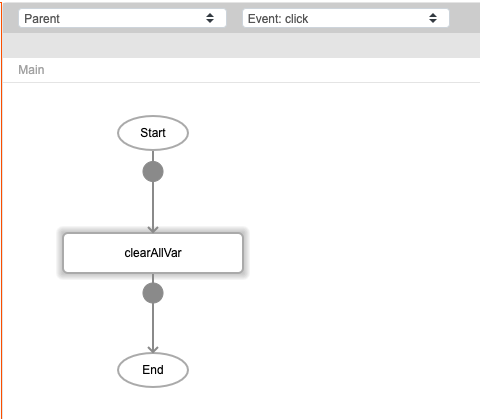

# clearAllVar

## Description

Removes all global variables in the app excluding the variables specified. 

## Input / Parameter

| Name | Description | Input Type | Default | Options | Required |
| ------ | ------ | ------ | ------ | ------ | ------ |
| except | The variables that should not be deleted. | String/Text | - | - | No |

## Output

N/A

Note: The global variables will be updated to remove all of them.

## Callback

N/A

## Video

Coming Soon.

<!-- Format:  -->

## Example

The user wants to remove all global variable in app.

### Step

1. Call the function.

    

### Result

All the variables will be removed.

## Links