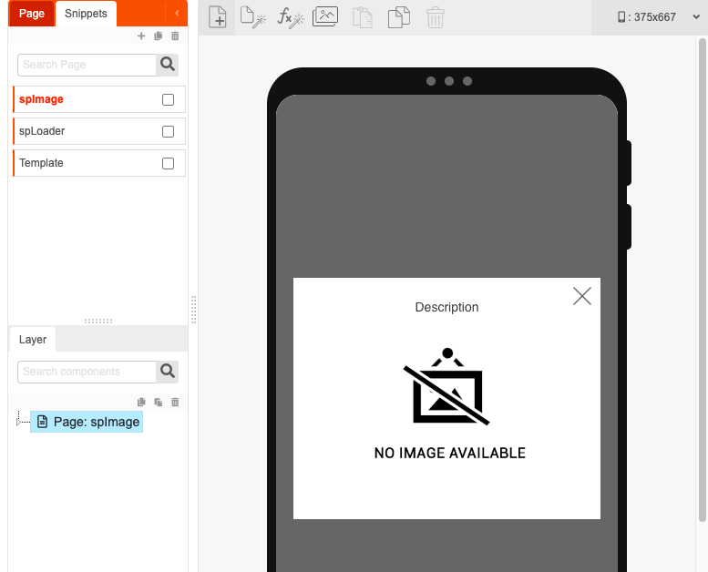
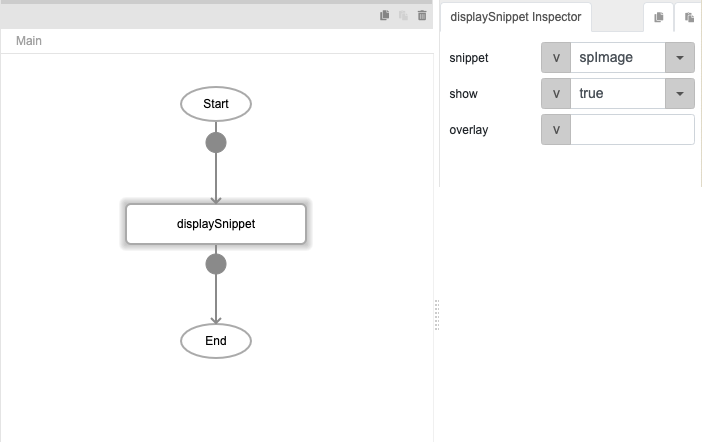
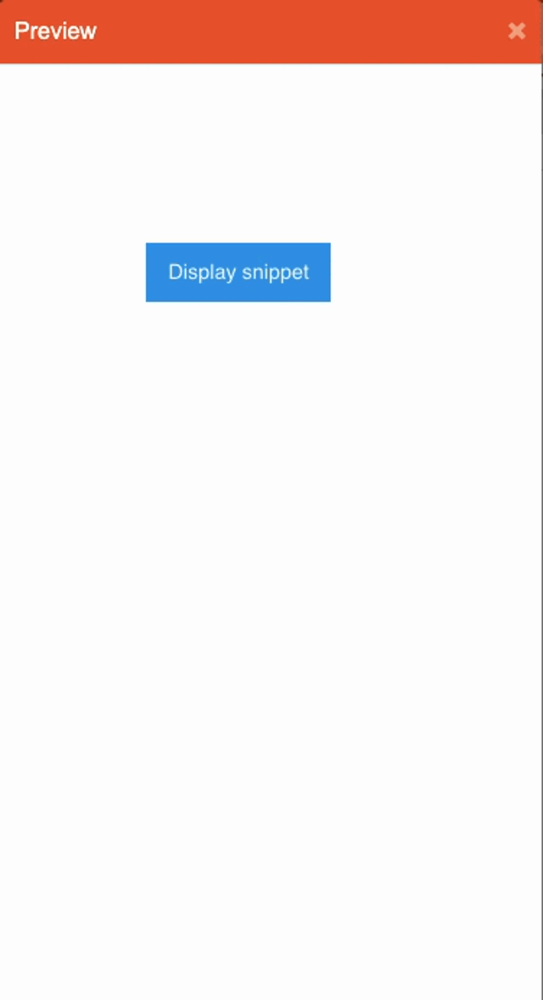

# displaySnippet

## Description

Allows users to decide whether to show or hide a snippet on the screen.

## Input / Parameter

| Name | Description | Input Type | Default | Options | Required |
| ------ | ------ | ------ | ------ | ------ | ------ |
| snippet | The snippet to be shown or hidden. | String/Text | - | - | Yes |
| show | To show or hide snippet. | Boolean | true | true, false | Yes |
| overlay? | To overlay or not. | Boolean | - | - | Yes |

## Output

N/A

Note: The page will be updated to show or hide the snippet.

## Callback

N/A

## Video

Coming Soon.

<!-- Format:  -->

## Example

### Steps

1. First, we will need to have a snippet to display or hide. Create one if you no already have one. In this example, we will be using this snippet named `spImage`.

    

2. Create a button, and add the `displaySnippet` function to the event flow. 
   
    

### Result

Clicking the button will display the snippet. 

<!-- Explain the output.

Format:  -->

## Links