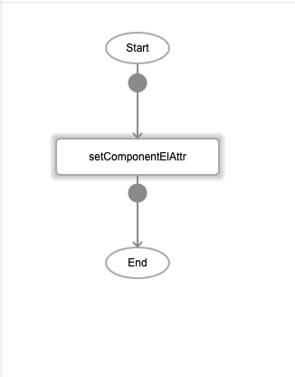

# setComponentElAttr

## Description

Allows users to set a new value for an attribute of a component.

## Input / Parameter

| Name | Description | Input Type | Default | Options | Required |
| ------ | ------ | ------ | ------ | ------ | ------ |
| component | The name of the component. | String/Text | - | - | Partial (Yes if no 'componentId'.) |
| componentId | The id of the component. | String/Text | - | - | Partial (Yes if no 'component'.) |
| attr | The attribute of the component. | String/Text | - | - | Yes |
| value | The value to be set for the attribute. | String/Text | - | - | Yes |

__\* Note:__ Either component or componentId must have value in order for this function to work.

## Output

N/A

Note: The component will be updated to show the new value assigned to the attribute.

## Callback

N/A

## Video

Coming Soon.

<!-- Format:  -->

## Example

The user override a specific element atrribute of a component.

### Step

1. Draw a button "btnSetComponentElAttr"

    
    
3. Call the function

    

    

### Result

The elemnet attribute "innerText" of a button "btnSetComponentElAttr" will have the value of "New Label".

## Links