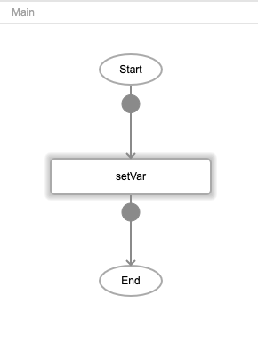
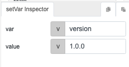
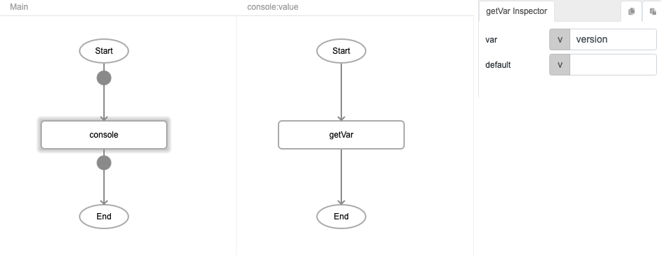

# setVar

## Description

Creates a global variable with a value associated to it.

## Input / Parameter

| Name | Description | Input Type | Default | Options | Required |
| ------ | ------ | ------ | ------ | ------ | ------ |
| var | The name of the variable to create. | String/Text | - | - | Yes |
| value | The value associated to the variable. | String/Text | - | - | Yes |

## Output

| Description | Output Type |
| ------ | ------ |
| Returns the value of the variable created. | String/Text |

## Callback

N/A

## Video

Coming Soon.

<!-- Format:  -->

## Example

### Steps

1. Drag the `setVar` function into the flow window. 
2. Create a variable called `version` with the value `1.0.0`   
3. This will create a global variable called "version" containing the value "1.0.0" that can be accessed by other components or on other pages of your app.

### Result

The value of the global variable `version` can be accessed by using the [`getVar`](./getvar) function. 

 

Using the above flow will display the value `1.0.0` in the browser console.

 

## Links

* See also [`getVar`](./getvar)