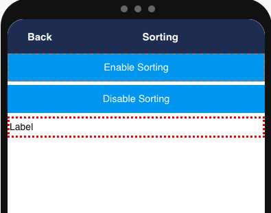
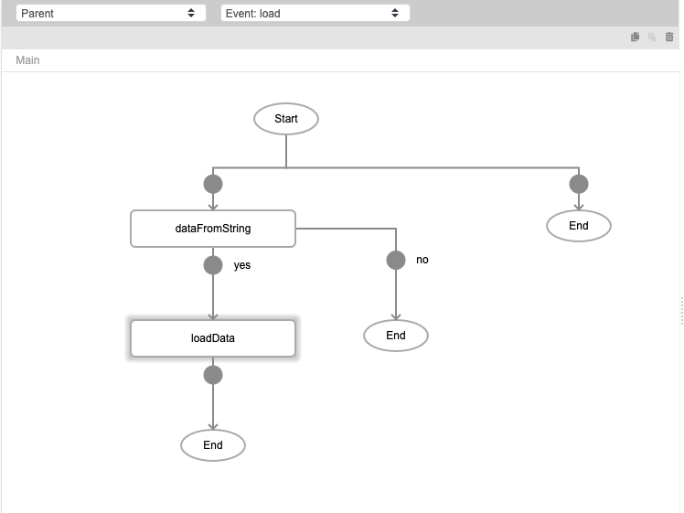
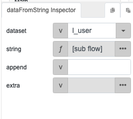
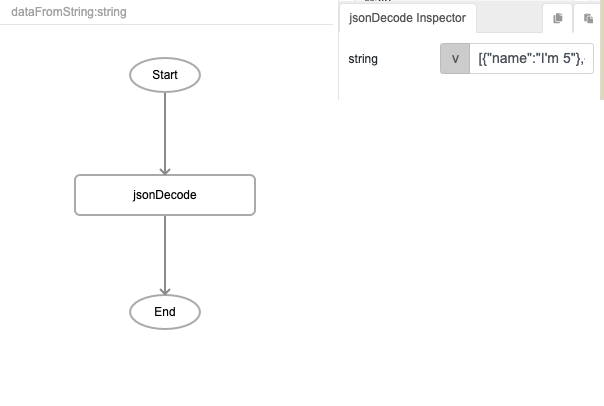
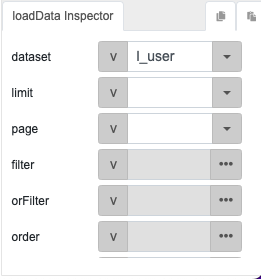
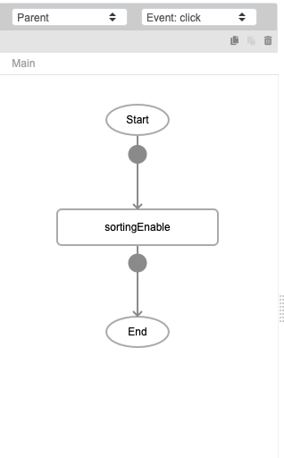
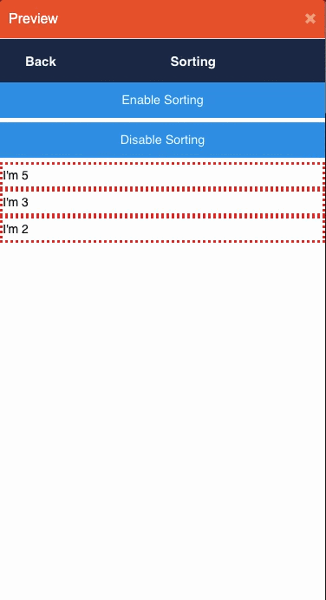

# sortingEnable

## Description

Enables the ability to sort a datalist component. 

## Input / Parameter

N/A

## Output

N/A

## Callback

N/A

## Video

Coming Soon.

<!-- Format:  -->

## Example

In this example, we will first create a data list, which can then be made sortable with the `sortingEnable` function.

### Steps

1. First, add a "Enable Sorting" button and a datalsit component to the page. 

    

2. To load data into the datalist, we will need to create the following event flow. 

    

    a. For the `dataFromString` function

    

    | Field | Value | 
    | ---- | ---- | 
    | dataset | l_user |
    | string |  |

    
    b. For the `loadData` function
    

3. Finally, for our "Enable Sorting" button, we will add the `sortingEnable` function when the button is clicked. 

    

<!-- Show the steps and share some screenshots.

1. .....

Format:  -->

### Result

<!-- Explain the output.

Format:  -->

## Links