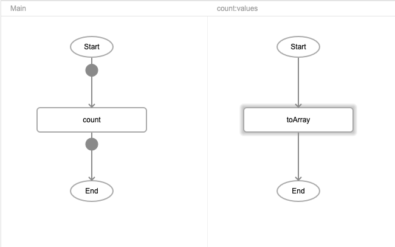
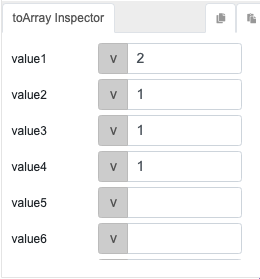

# count

## Description

Counts the number of elements in an array. An array can be created using the toArray function.

## Input / Parameter

| Name | Description | Input Type | Default | Options | Required |
| ------ | ------ | ------ | ------ | ------ | ------ |
| values | The array of values. | Array/List | - | - | Yes |

## Output

| Description | Output Type |
| ------ | ------ |
| Returns the total number of elements in the array. | Number |

## Callback

N/A

## Video

Coming Soon.

<!-- Format:  -->

## Example

The user wants to count all the data in an array.

### Step

1. Call the function "count".

     
     
2. Call the function "toArray" and define the value of array. 
   value1  : 2 
   value2  : 1 
   value3  : 1 
   value4  : 1 

     

### Result

4

## Links