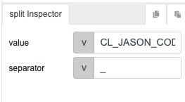
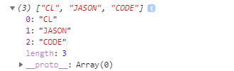

# split

## Description

Breaks a single string into multiple smaller strings using a separator.

## Input / Parameter

| Name | Description | Input Type | Default | Options | Required |
| ------ | ------ | ------ | ------ | ------ | ------ |
| value | The string to break into smaller parts. | String/Text | - | - | Yes |
| separator | The separator to break the string by. | String/Text | - | - | Yes |

<!-- Example: ( ), { }, [ ], ";", ".", ",", ":" -->

## Output

| Description | Output Type |
| ------ | ------ |
| Returns an array containing the multiple smaller strings. | Array/List |

## Callback

N/A

## Video

Coming Soon.

<!-- Format:  -->

## Example

The user wants to split the string.

### Step

1. Call the function.
     
    value : CL_JASON_CODE 
    separator : _
    
    
    

 
### Result

## Links