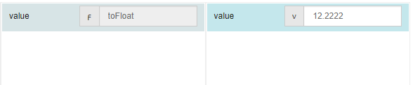

# toFloat

## Description

Converts a passed value to a float type.

## Input / Parameter

| Name | Description | Input Type | Default | Options | Required |
| ------ | ------ | ------ | ------ | ------ | ------ |
| value | The value to convert to a float. | Any | - | - | Yes |

## Output

| Description | Output Type |
| ------ | ------ |
| Returns the passed value as a float. | Number |

## Callback

N/A

## Video

Coming Soon.

<!-- Format:  -->

## Example

User want to convert a value to float type.

### Step

1. Call the function.
    
   value : 12.2222

  
 
### Result

12.2222(toFloat function parses a string and returns a floating point number.)

## Links