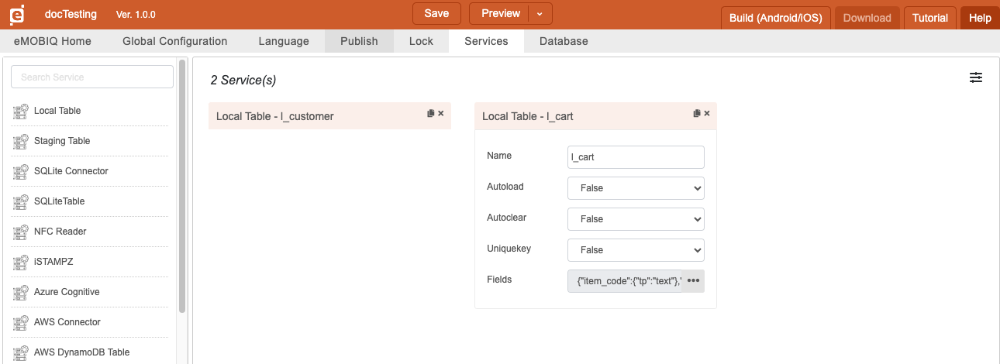
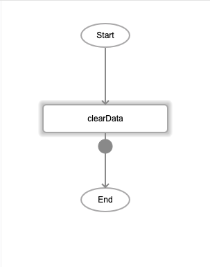
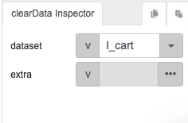
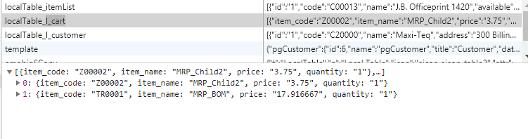
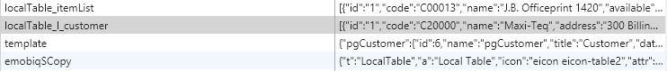

# clearData 

## Description

Removes the local table specified from a project.

## Input / Parameter

| Name | Description | Input Type | Default | Options | Required |
| ------ | ------ | ------ | ------ | ------ | ------ |
| dataset | The name of the dataset to remove. | String/Text | - | - | Yes |
| extra | Extra parameters stored and passed to callback. | Any | - | - | No |

## Output

| Description | Output Type |
| ------ | ------ |
| Returns an empty list. | Array/List |

## Callback?

### callback

The function to be executed if the dataset is removed successfully.

### errorCallback

The function to be executed if the dataset is not removed successfully.

## Video

Coming Soon.

<!-- Format: []({url-link}) -->


## Example


The user wants to delete the dataset `lcart` from local table.

### Step

1. Create a local table `lcart`.
   
   

2. Add some fields for the table: 

   ```
   item_code
   item_name
   price
   quantity
   ```

   
  
3. Call the "clearData" function and define the     dataset.
   
   

   ```
   dataset: l_cart
   ```
   
   
### Result



Before calling the `clearData` function, the dataset `lcart` exists as a local table. )



After calling clearData, l_cart no longer exists. 


## Links