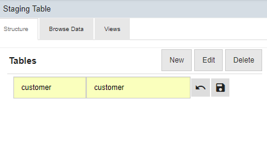
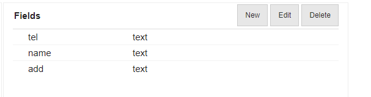
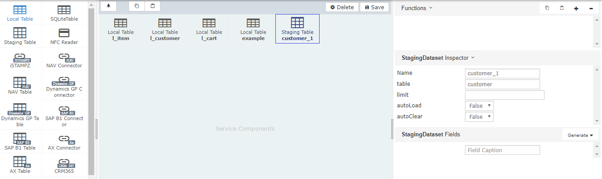
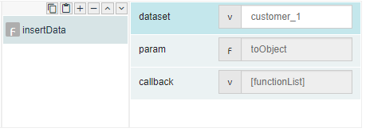
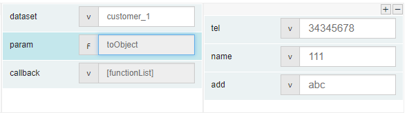
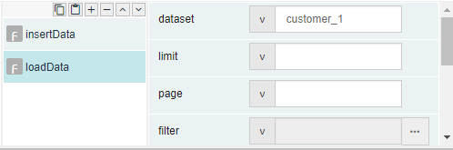
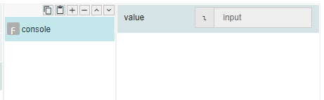
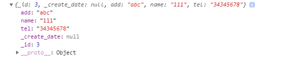
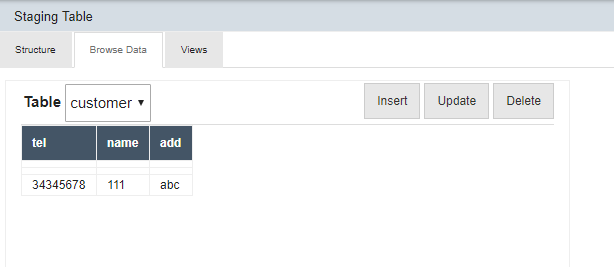

# insertData

## Description

Insert or add value in a staging database.

## Input / Parameters

| No | Name | Description | Data Type | Required |
| ------ | ------ | ------ |------ | ------ |
| 1 | dataset | Name of the dataset in stagging table where the record will be inserted. | String | Yes  |
| 2 | param | Object name | Object | Yes |

## Output

## Callback

## Video

## Example

The user wants to insert the data into staging table.

### Step

1. Create a table with a table name and field in      staging table. 
    
   table name: customer 
   Fields name: tel, name and add
                
   
   
   
   
2. Create a dataset is  in Services.
    
   dataset: customer_1 
   
   

3. Call the function "insertData", define the         dataset and set function "toObject"to              param.
    
   dataset: customer_1 
   param: toObject 
   
   
   
4. Define the tel, name and add.
    
   tel: 34345678 
   name: 111 
   add: abc 
   
   
   
5. Call the function "loadData"and define the         dataset. 
   dataset: customer_1 
   
   
   
6. Add a console after callback for display the       response from console.

   
  
### Result

 
 
  
 
## Notes

- N/A