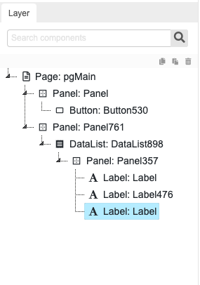
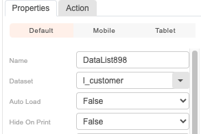
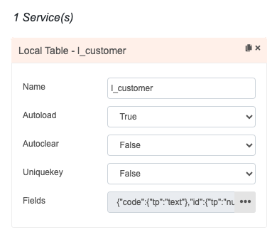
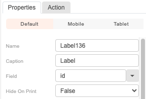
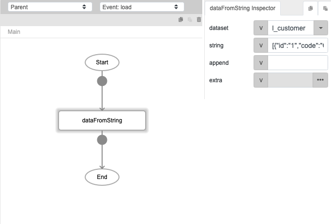
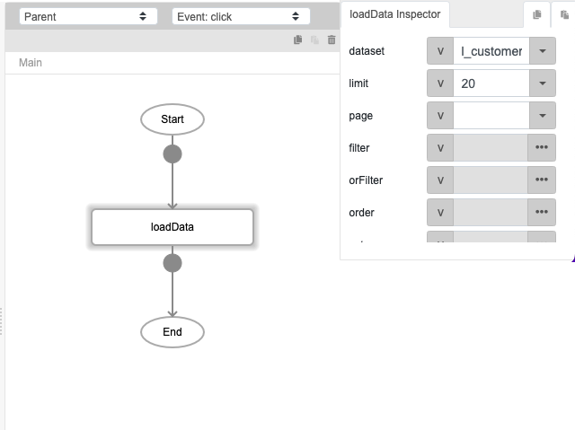
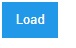
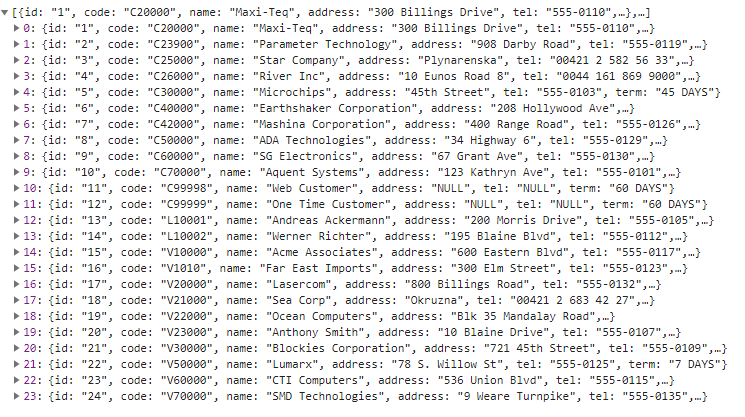
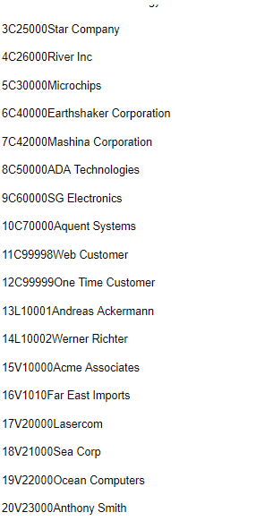

# loadData

## Description

Loads the data from a local table, staging database or 3rd party connector.

## Input / Parameter

| Name | Description | Input Type | Default | Options | Required |
| ------ | ------ | ------ | ------ | ------ | ------ |
| dataset | The name of the local table to load data from. | String/Text | - | - | Yes |
| limit | The number of records to be returned from the local table. | Number | - | - | No |
| page | The page number. | Number | - | - | No |
| filter | The filters for the fields and values to retrieve. | Array/List | - | - | Yes |
| orFilter | Additional filters for the fields and values to retrieve. | Array/List | - | - | No |
| order | Sorts the data with the provided details. | Array/List | - | - | No |
| extra | Extra parameters stored and passed to callback. | Any | - | - | No |

## Output

| Description | Output Type |
| ------ | ------ |
| Returns the list of records that is loaded. | Array/List |

## Callback?

### callback

The function to be executed if the records are loaded successfully.

### errorCallback

The function to be executed if the records are not loaded successfully.

## Video

Coming Soon.

<!-- Format:  -->

## Example

The user wants to load the data from dataset "l_customer".

### Step

1. Create a button, pannel, datalist and       label from component. 

   

   
 
   ( Set the dataset name "l_customer" for column Dataset. We assumed the dataset name have been created when you create local table in Services. )

   

   
 
   (  When you click the each label, set the field name to "code" "id" and "name" respectively for field column. ) 
   
2. Call the function "dataFromString" and      define the dataset and string. 
   dataset: l_customer 
   string: [{"id":"1","code":"C20000","name":"Maxi-Teq","address":"300 Billings Drive","tel":"555-0110","term":"C.O.D"},{"id":"2","code":"C23900","name":"Parameter Technology","address":"908 Darby Road","tel":"555-0119","term":"C.O.D"}
   
   

3. Call the function "loadData"and define      the dataset and limit. 
   dataset: l_customer 
   limit: 20

   

### Result

( When you call the function "dataFromString", and put a string in json format.The outcome was shown in image above. )
 

  
( When you call the function "loadData", and set the limit is 20, therefore it will display the data from id 1-20 instead of until id 24. )

## Links