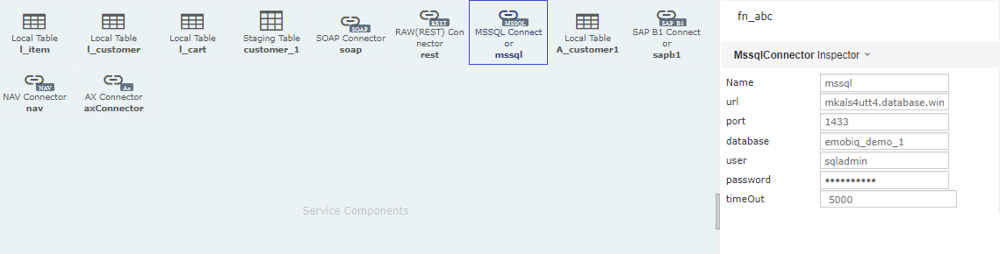
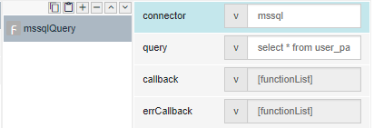
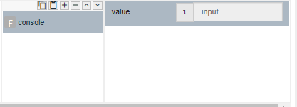
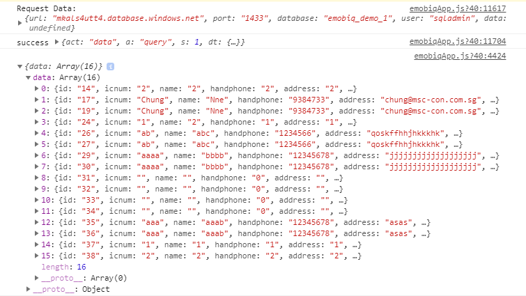

# mssqlQuery 

## Description

Query languages are used to make queries in a database, and Microsoft Structured Query Language (SQL) is used to query, insert, update and modify data.

## Input / Parameters

| No | Name | Description | Data Type | Required |
| ------ | ------ | ------ |------ | ------ |
| 1 | connector | Name of connector and created in the Services and Global Components page. | String | Yes  |
| 2 | query | A query is a request for data or information from a database table or combination of tables. | String | Yes |

## Output

## Callback

## Video

## Example

The user wants to call the mssqlQuery 
Web Service.

### Step

1. To create MSSQL Connector in Services and          define the  name, url, port, database,             user, password and timeOut.
    Name: mssql 
   url: mkals4utt4.database.windows.net
   port: 1433 
   database: emobiq_demo_1 
   user: sqladmin 
   password: ******** 
   timeOut: 5000
 
   
  
2. Call the function "mssqlQuery"and define the       connector and query.
    connector: mssql 
   query: select * from user_package 
    
   
   
3. Add a console for display the response from        console. 

   

### Result

  
## Links