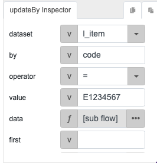
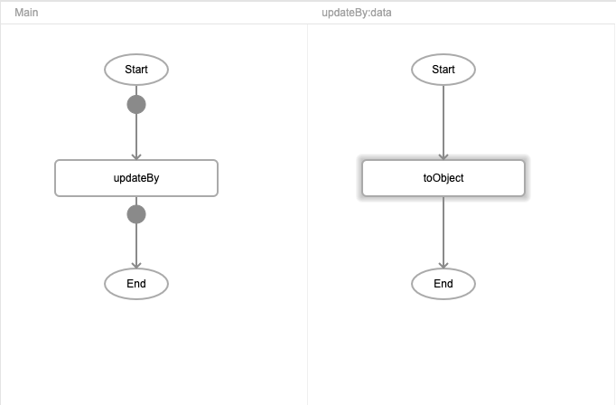
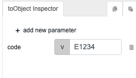

# updateBy

## Description

Updates the record from a specified field in a dataset.

## Input / Parameter

| Name | Description | Input Type | Default | Options | Required |
| ------ | ------ | ------ | ------ | ------ | ------ |
| dataset | The name of the local table to update the record from. | String/Text | - | - | Yes |
| by | The name of the field to update the record from. | String/Text | - | - | Yes |
| operator | The operator to use to determine the record to update. | String/Text | = | =, >, <, >=, <=, !=, like, ilike | No |
| value | The record to be updated from the local table. | String/Text | - | - | Yes |
| data | The data to update the record with. | Object | - | - | Yes |
| first? | ? | String/Text | - | - | No |
| extra | Extra parameters stored and passed to callback. | Any | - | - | No |

## Output

| Description | Output Type |
| ------ | ------ |
| Returns the updated list of records from the local table. | Array/List |

## Callback?

### callback

The function to be executed if the specified records are updated successfully.

### errCallback

The function to be executed if the specified records are not updated successfully.

## Video

Coming Soon.

<!-- Format:  -->

## Example

The user wants to update the code from E1234567 to E1234 in dataset "l_item".

### Step

1. Call the function "updateBy".

   

2. Specify the parameters: 
   | | | 
   | ---- | ---- | 
   | dataset | l_item | 
   | by | code |
   | operator | = |
   | value | E1234567 |

    

 
 2. Set toObject function to data and define the      value of object.

   | | | 
   | ---- | ---- | 
   | data | toObject | 
   | code | E1234 | 

   

   

### Result

   
   ( Before update, the code is E1234567 )
   
   
   ( After update, the code changed to E1234 )
   

## Links