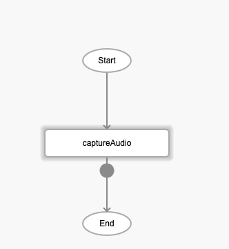
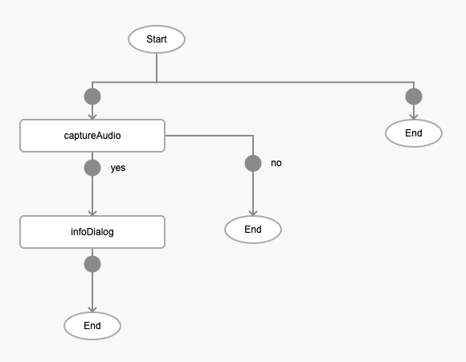
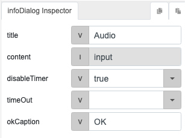

# captureAudio

## Description

Activates the voice recording of the mobile device to capture audio.

## Input / Parameter

N/A

## Output

N/A

## Callback

### callback

The function to be executed when the voice recording is generated successfully.

### errorCallback

The function to be executed when the voice recording is not generated successfully.

## Video

Coming Soon.

<!-- Format:  -->

## Example

The user wants to create a voice recording using their mobile device.

<!-- Share a scenario, like a user requirements. -->

### Steps

| No. | Description |  |
| ------ | ------ | ------ |
| 1. |  | Drag a button component to a page in the mobile designer. Select the event `click` and drag the `captureAudio` function to the event flow. |
| 2. |  | Drag the function to be executed if the audio recording is successfully generated to the node below the function. In this example, we are using the `infoDialog` function. |
| 3. |  | Fill in the parameters of the function. |

<!-- Show the steps and share some screenshots.

1. .....

Format:  -->

### Result

The audio file recorded will be shown in the dialog modal.

<!-- Explain the output.

Format:  -->

## Links
